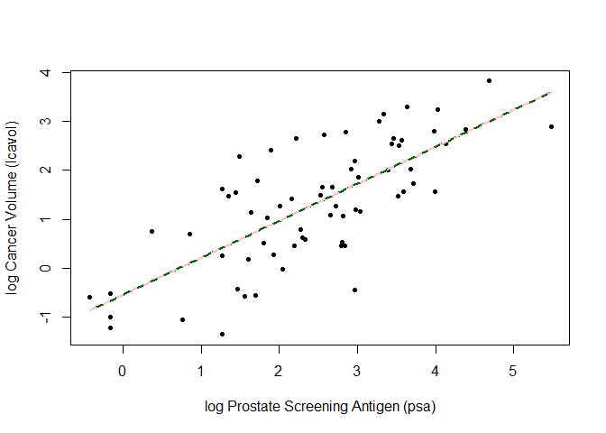
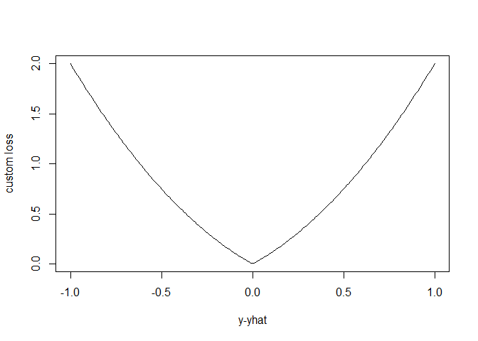
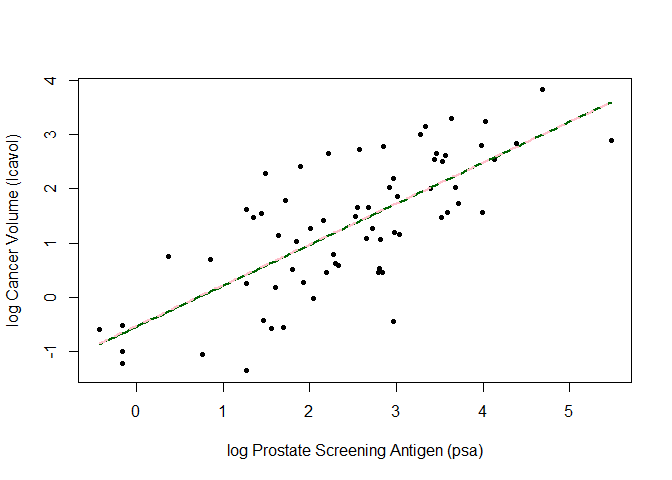
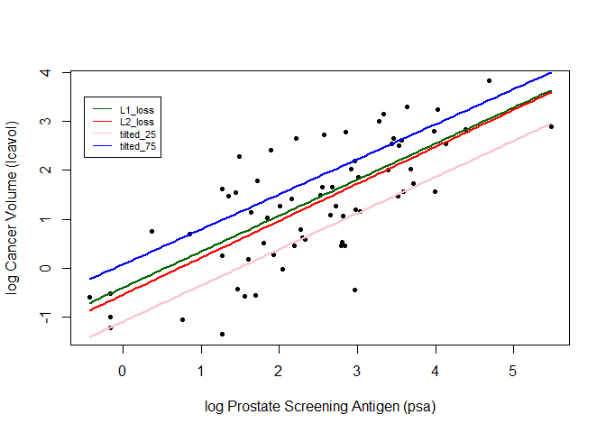
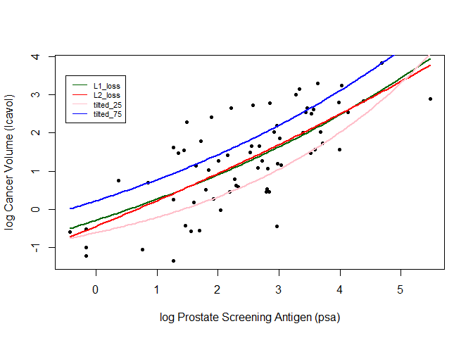

    library(purrr)
    library(qrnn)
    ## load prostate data
    prostate <- 
      read.table(url(
        'https://web.stanford.edu/~hastie/ElemStatLearn/datasets/prostate.data'))

    ## subset to training examples
    prostate_train <- subset(prostate, train==TRUE)

    ## plot lcavol vs lpsa
    plot_psa_data <- function(dat=prostate_train) {
      plot(dat$lpsa, dat$lcavol,
           xlab="log Prostate Screening Antigen (psa)",
           ylab="log Cancer Volume (lcavol)",
           pch = 20)
    }
    plot_psa_data()

    ############################
    ## regular linear regression
    ############################

    ## L2 loss function
    L2_loss <- function(y, yhat)
      (y-yhat)^2

    ## fit simple linear model using numerical optimization
    fit_lin <- function(y, x, loss=L2_loss, beta_init = c(-0.51, 0.75)) {
      err <- function(beta)
        mean(loss(y,  beta[1] + beta[2]*x))
      beta <- optim(par = beta_init, fn = err)
      return(beta)
    }

    ## make predictions from linear model
    predict_lin <- function(x, beta)
      beta[1] + beta[2]*x

    ## fit linear model
    lin_beta <- fit_lin(y=prostate_train$lcavol,
                        x=prostate_train$lpsa,
                        loss=L2_loss)

    ## compute predictions for a grid of inputs
    x_grid <- seq(min(prostate_train$lpsa),
                  max(prostate_train$lpsa),
                  length.out=100)
    lin_pred <- predict_lin(x=x_grid, beta=lin_beta$par)

    ## plot data
    plot_psa_data()

    ## plot predictions
    lines(x=x_grid, y=lin_pred, col='darkgreen', lwd=2)

    ## do the same thing with 'lm'
    lin_fit_lm <- lm(lcavol ~ lpsa, data=prostate_train)

    ## make predictins using 'lm' object
    lin_pred_lm <- predict(lin_fit_lm, data.frame(lpsa=x_grid))

    ## plot predictions from 'lm'
    lines(x=x_grid, y=lin_pred_lm, col='pink', lty=2, lwd=2)

    ##################################
    ## try modifying the loss function
    ##################################

    ## custom loss function
    custom_loss <- function(y, yhat)
      (y-yhat)^2 + abs(y-yhat)

    ## plot custom loss function
    err_grd <- seq(-1,1,length.out=200)
    plot(err_grd, custom_loss(err_grd,0), type='l',
         xlab='y-yhat', ylab='custom loss')

    ## fit linear model with custom loss
    lin_beta_custom <- fit_lin(y=prostate_train$lcavol,
                        x=prostate_train$lpsa,
                        loss=custom_loss)

    lin_pred_custom <- predict_lin(x=x_grid, beta=lin_beta_custom$par)

    ## plot data
    plot_psa_data()

    ## plot predictions from L2 loss
    lines(x=x_grid, y=lin_pred, col='darkgreen', lwd=2)

    ## plot predictions from custom loss
    lines(x=x_grid, y=lin_pred_custom, col='pink', lwd=2, lty=2)

**Question 1**

    ## L1 loss function
    L1_loss <- function(y, yhat){
      abs(y-yhat)
    }

    ## Tilted Loss Function
    tilted_loss<-function(y,yhat,tau){
      tilted.abs(y-yhat,tau)
    }

**Question 2**

    fit_lin_modified <- function(y, x, loss, beta_init = c(-0.51, 0.75)) {
      err <- function(beta)
        mean(loss(y,  beta[1] + beta[2]*x))
      beta <- optim(par = beta_init, fn = err)
      return(beta$par)
    }

    predict_lin <- function(x, beta)
      beta[1] + beta[2]*x

    #Get the optimized beta of each function

    lin_beta_L1 <- fit_lin_modified(y=prostate_train$lcavol,
                        x=prostate_train$lpsa,
                        loss=L1_loss)
    lin_beta_L2 <- fit_lin_modified(y=prostate_train$lcavol,
                        x=prostate_train$lpsa,
                        loss=L2_loss)
    lin_beta_tilted_25<- fit_lin_modified(y=prostate_train$lcavol,
                        x=prostate_train$lpsa,
                        loss=partial(tilted_loss,tau=0.25))
    lin_beta_tilted_75<- fit_lin_modified(y=prostate_train$lcavol,
                        x=prostate_train$lpsa,
                        loss=partial(tilted_loss,tau=0.75))

    ## compute predictions for a grid of inputs
    x_grid <- seq(min(prostate_train$lpsa),
                  max(prostate_train$lpsa),
                  length.out=100)

    lin_pred_L1 <- predict_lin(x=x_grid, beta=lin_beta_L1)
    lin_pred_L2 <- predict_lin(x=x_grid, beta=lin_beta_L2)
    lin_pred_tilted_25 <- predict_lin(x=x_grid, beta=lin_beta_tilted_25)
    lin_pred_tilted_75 <- predict_lin(x=x_grid, beta=lin_beta_tilted_75)

    ## plot predictions
    plot_psa_data()
    lines(x=x_grid, y=lin_pred_L1, col='darkgreen', lwd=2)
    lines(x=x_grid, y=lin_pred_L2, col='red', lwd=2)
    lines(x=x_grid, y=lin_pred_tilted_25, col='pink', lwd=2)
    lines(x=x_grid, y=lin_pred_tilted_75, col='blue', lwd=2)
    legend(-0.5,3.5,legend=c("L1_loss","L2_loss","tilted_25","tilted_75"),col=c("darkgreen","red","pink","blue"),lty=1,cex=0.7)

**Question 3**

    fit_lin_q3<- function(y, x, loss, beta_init = c(-0.51, 0.75,0)) {
      err <- function(beta)
        mean(loss(y,  beta[1] + beta[2]*exp(-beta[3]*x)))
      beta <- optim(par = beta_init, fn = err)
      return(beta$par)
    }
    predict_lin_q3 <- function(x, beta)
      beta[1] + beta[2]*exp(-beta[3]*x)

    #Get the optimized beta of each function

    lin_beta_L1_q3 <- fit_lin_q3(y=prostate_train$lcavol,
                        x=prostate_train$lpsa,
                        loss=L1_loss)
    lin_beta_L2_q3 <- fit_lin_q3(y=prostate_train$lcavol,
                        x=prostate_train$lpsa,
                        loss=L2_loss)
    lin_beta_tilted_25_q3<- fit_lin_q3(y=prostate_train$lcavol,
                        x=prostate_train$lpsa,
                        loss=partial(tilted_loss,tau=0.25))
    lin_beta_tilted_75_q3<- fit_lin_q3(y=prostate_train$lcavol,
                        x=prostate_train$lpsa,
                        loss=partial(tilted_loss,tau=0.75))

    ## compute predictions for a grid of inputs
    x_grid <- seq(min(prostate_train$lpsa),
                  max(prostate_train$lpsa),
                  length.out=100)

    lin_pred_L1_q3 <- predict_lin(x=x_grid, beta=lin_beta_L1_q3)
    lin_pred_L2_q3 <- predict_lin(x=x_grid, beta=lin_beta_L2_q3)
    lin_pred_tilted_25_q3 <- predict_lin(x=x_grid, beta=lin_beta_tilted_25_q3)
    lin_pred_tilted_75_q3 <- predict_lin(x=x_grid, beta=lin_beta_tilted_75_q3)

**Question 4**

    ## plot predictions
    plot_psa_data()
    lines(x=x_grid, y=lin_pred_L1_q3, col='darkgreen', lwd=2)
    lines(x=x_grid, y=lin_pred_L2_q3, col='red', lwd=2)
    lines(x=x_grid, y=lin_pred_tilted_25_q3, col='pink', lwd=2)
    lines(x=x_grid, y=lin_pred_tilted_75_q3, col='blue', lwd=2)
    legend(-0.5,3.5,legend=c("L1_loss","L2_loss","tilted_25","tilted_75"),col=c("darkgreen","red","pink","blue"),lty=1,cex=0.7)

