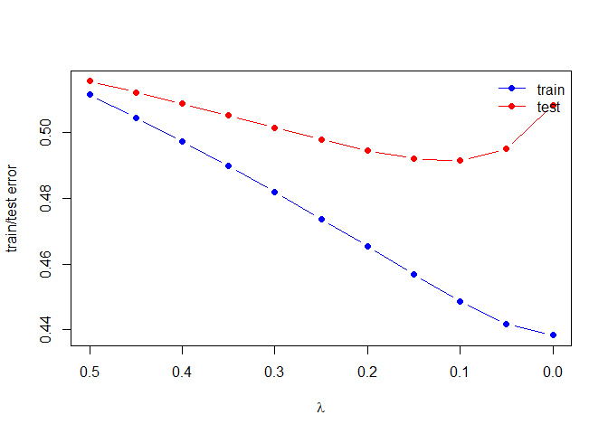
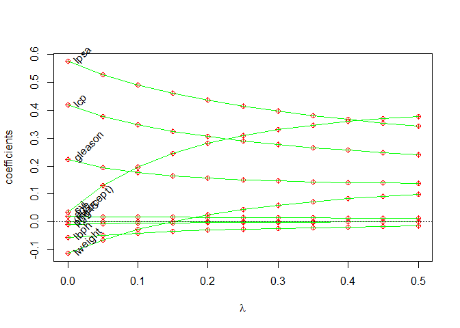

**1. Load the prostate cancer data**

    library(dplyr)

    ## 
    ## Attaching package: 'dplyr'

    ## The following objects are masked from 'package:stats':
    ## 
    ##     filter, lag

    ## The following objects are masked from 'package:base':
    ## 
    ##     intersect, setdiff, setequal, union

    library(glmnet)

    ## Loading required package: Matrix

    ## Loaded glmnet 4.1-3

    library(magrittr)
    library(splines)
    prostate <- 
      read.table(url(
        'https://web.stanford.edu/~hastie/ElemStatLearn/datasets/prostate.data'))

**2. Reproduce correlation matrix**

    corre<-round(cor(y=prostate[,1:7],x=prostate[,2:8],method="pearson"),3)
    corre[upper.tri(corre)]<-""
    corre<-as.data.frame(corre)
    corre

    ##         lcavol lweight   age   lbph   svi   lcp gleason
    ## lweight  0.281                                         
    ## age      0.225   0.348                                 
    ## lbph     0.027   0.442  0.35                           
    ## svi      0.539   0.155 0.118 -0.086                    
    ## lcp      0.675   0.165 0.128 -0.007 0.673              
    ## gleason  0.432   0.057 0.269  0.078  0.32 0.515        
    ## pgg45    0.434   0.107 0.276  0.078 0.458 0.632   0.752

    prostate

    ##          lcavol  lweight age        lbph svi         lcp gleason pgg45
    ## 1  -0.579818495 2.769459  50 -1.38629436   0 -1.38629436       6     0
    ## 2  -0.994252273 3.319626  58 -1.38629436   0 -1.38629436       6     0
    ## 3  -0.510825624 2.691243  74 -1.38629436   0 -1.38629436       7    20
    ## 4  -1.203972804 3.282789  58 -1.38629436   0 -1.38629436       6     0
    ## 5   0.751416089 3.432373  62 -1.38629436   0 -1.38629436       6     0
    ## 6  -1.049822124 3.228826  50 -1.38629436   0 -1.38629436       6     0
    ## 7   0.737164066 3.473518  64  0.61518564   0 -1.38629436       6     0
    ## 8   0.693147181 3.539509  58  1.53686722   0 -1.38629436       6     0
    ## 9  -0.776528789 3.539509  47 -1.38629436   0 -1.38629436       6     0
    ## 10  0.223143551 3.244544  63 -1.38629436   0 -1.38629436       6     0
    ## 11  0.254642218 3.604138  65 -1.38629436   0 -1.38629436       6     0
    ## 12 -1.347073648 3.598681  63  1.26694760   0 -1.38629436       6     0
    ## 13  1.613429934 3.022861  63 -1.38629436   0 -0.59783700       7    30
    ## 14  1.477048724 2.998229  67 -1.38629436   0 -1.38629436       7     5
    ## 15  1.205970807 3.442019  57 -1.38629436   0 -0.43078292       7     5
    ## 16  1.541159072 3.061052  66 -1.38629436   0 -1.38629436       6     0
    ## 17 -0.415515444 3.516013  70  1.24415459   0 -0.59783700       7    30
    ## 18  2.288486169 3.649359  66 -1.38629436   0  0.37156356       6     0
    ## 19 -0.562118918 3.267666  41 -1.38629436   0 -1.38629436       6     0
    ## 20  0.182321557 3.825375  70  1.65822808   0 -1.38629436       6     0
    ## 21  1.147402453 3.419365  59 -1.38629436   0 -1.38629436       6     0
    ## 22  2.059238834 3.501043  60  1.47476301   0  1.34807315       7    20
    ## 23 -0.544727175 3.375880  59 -0.79850770   0 -1.38629436       6     0
    ## 24  1.781709133 3.451574  63  0.43825493   0  1.17865500       7    60
    ## 25  0.385262401 3.667400  69  1.59938758   0 -1.38629436       6     0
    ## 26  1.446918983 3.124565  68  0.30010459   0 -1.38629436       6     0
    ## 27  0.512823626 3.719651  65 -1.38629436   0 -0.79850770       7    70
    ## 28 -0.400477567 3.865979  67  1.81645208   0 -1.38629436       7    20
    ## 29  1.040276712 3.128951  67  0.22314355   0  0.04879016       7    80
    ## 30  2.409644165 3.375880  65 -1.38629436   0  1.61938824       6     0
    ## 31  0.285178942 4.090169  65  1.96290773   0 -0.79850770       6     0
    ## 32  0.182321557 3.804438  65  1.70474809   0 -1.38629436       6     0
    ## 33  1.275362800 3.037354  71  1.26694760   0 -1.38629436       6     0
    ## 34  0.009950331 3.267666  54 -1.38629436   0 -1.38629436       6     0
    ## 35 -0.010050336 3.216874  63 -1.38629436   0 -0.79850770       6     0
    ## 36  1.308332820 4.119850  64  2.17133681   0 -1.38629436       7     5
    ## 37  1.423108334 3.657131  73 -0.57981850   0  1.65822808       8    15
    ## 38  0.457424847 2.374906  64 -1.38629436   0 -1.38629436       7    15
    ## 39  2.660958594 4.085136  68  1.37371558   1  1.83258146       7    35
    ## 40  0.797507196 3.013081  56  0.93609336   0 -0.16251893       7     5
    ## 41  0.620576488 3.141995  60 -1.38629436   0 -1.38629436       9    80
    ## 42  1.442201993 3.682610  68 -1.38629436   0 -1.38629436       7    10
    ## 43  0.582215620 3.865979  62  1.71379793   0 -0.43078292       6     0
    ## 44  1.771556762 3.896909  61 -1.38629436   0  0.81093022       7     6
    ## 45  1.486139696 3.409496  66  1.74919985   0 -0.43078292       7    20
    ## 46  1.663926098 3.392829  61  0.61518564   0 -1.38629436       7    15
    ## 47  2.727852828 3.995445  79  1.87946505   1  2.65675691       9   100
    ## 48  1.163150810 4.035125  68  1.71379793   0 -0.43078292       7    40
    ## 49  1.745715531 3.498022  43 -1.38629436   0 -1.38629436       6     0
    ## 50  1.220829921 3.568123  70  1.37371558   0 -0.79850770       6     0
    ## 51  1.091923301 3.993603  68 -1.38629436   0 -1.38629436       7    50
    ## 52  1.660131027 4.234831  64  2.07317193   0 -1.38629436       6     0
    ## 53  0.512823626 3.633631  64  1.49290410   0  0.04879016       7    70
    ## 54  2.127040520 4.121473  68  1.76644166   0  1.44691898       7    40
    ## 55  3.153590358 3.516013  59 -1.38629436   0 -1.38629436       7     5
    ## 56  1.266947603 4.280132  66  2.12226154   0 -1.38629436       7    15
    ## 57  0.974559640 2.865054  47 -1.38629436   0  0.50077529       7     4
    ## 58  0.463734016 3.764682  49  1.42310833   0 -1.38629436       6     0
    ## 59  0.542324291 4.178226  70  0.43825493   0 -1.38629436       7    20
    ## 60  1.061256502 3.851211  61  1.29472717   0 -1.38629436       7    40
    ## 61  0.457424847 4.524502  73  2.32630162   0 -1.38629436       6     0
    ## 62  1.997417706 3.719651  63  1.61938824   1  1.90954250       7    40
    ## 63  2.775708850 3.524889  72 -1.38629436   0  1.55814462       9    95
    ## 64  2.034705648 3.917011  66  2.00821403   1  2.11021320       7    60
    ## 65  2.073171929 3.623007  64 -1.38629436   0 -1.38629436       6     0
    ## 66  1.458615023 3.836221  61  1.32175584   0 -0.43078292       7    20
    ## 67  2.022871190 3.878466  68  1.78339122   0  1.32175584       7    70
    ## 68  2.198335072 4.050915  72  2.30757263   0 -0.43078292       7    10
    ## 69 -0.446287103 4.408547  69 -1.38629436   0 -1.38629436       6     0
    ## 70  1.193922468 4.780383  72  2.32630162   0 -0.79850770       7     5
    ## 71  1.864080131 3.593194  60 -1.38629436   1  1.32175584       7    60
    ## 72  1.160020917 3.341093  77  1.74919985   0 -1.38629436       7    25
    ## 73  1.214912744 3.825375  69 -1.38629436   1  0.22314355       7    20
    ## 74  1.838961071 3.236716  60  0.43825493   1  1.17865500       9    90
    ## 75  2.999226163 3.849083  69 -1.38629436   1  1.90954250       7    20
    ## 76  3.141130476 3.263849  68 -0.05129329   1  2.42036813       7    50
    ## 77  2.010894999 4.433789  72  2.12226154   0  0.50077529       7    60
    ## 78  2.537657215 4.354784  78  2.32630162   0 -1.38629436       7    10
    ## 79  2.648300197 3.582129  69 -1.38629436   1  2.58399755       7    70
    ## 80  2.779440197 3.823192  63 -1.38629436   0  0.37156356       7    50
    ## 81  1.467874348 3.070376  66  0.55961579   0  0.22314355       7    40
    ## 82  2.513656063 3.473518  57  0.43825493   0  2.32727771       7    60
    ## 83  2.613006652 3.888754  77 -0.52763274   1  0.55961579       7    30
    ## 84  2.677590994 3.838376  65  1.11514159   0  1.74919985       9    70
    ## 85  1.562346305 3.709907  60  1.69561561   0  0.81093022       7    30
    ## 86  3.302849259 3.518980  64 -1.38629436   1  2.32727771       7    60
    ## 87  2.024193067 3.731699  58  1.63899671   0 -1.38629436       6     0
    ## 88  1.731655545 3.369018  62 -1.38629436   1  0.30010459       7    30
    ## 89  2.807593831 4.718052  65 -1.38629436   1  2.46385324       7    60
    ## 90  1.562346305 3.695110  76  0.93609336   1  0.81093022       7    75
    ## 91  3.246490992 4.101817  68 -1.38629436   0 -1.38629436       6     0
    ## 92  2.532902848 3.677566  61  1.34807315   1 -1.38629436       7    15
    ## 93  2.830267834 3.876396  68 -1.38629436   1  1.32175584       7    60
    ## 94  3.821003607 3.896909  44 -1.38629436   1  2.16905370       7    40
    ## 95  2.907447359 3.396185  52 -1.38629436   1  2.46385324       7    10
    ## 96  2.882563575 3.773910  68  1.55814462   1  1.55814462       7    80
    ## 97  3.471966453 3.974998  68  0.43825493   1  2.90416508       7    20
    ##          lpsa train
    ## 1  -0.4307829  TRUE
    ## 2  -0.1625189  TRUE
    ## 3  -0.1625189  TRUE
    ## 4  -0.1625189  TRUE
    ## 5   0.3715636  TRUE
    ## 6   0.7654678  TRUE
    ## 7   0.7654678 FALSE
    ## 8   0.8544153  TRUE
    ## 9   1.0473190 FALSE
    ## 10  1.0473190 FALSE
    ## 11  1.2669476  TRUE
    ## 12  1.2669476  TRUE
    ## 13  1.2669476  TRUE
    ## 14  1.3480731  TRUE
    ## 15  1.3987169 FALSE
    ## 16  1.4469190  TRUE
    ## 17  1.4701758  TRUE
    ## 18  1.4929041  TRUE
    ## 19  1.5581446  TRUE
    ## 20  1.5993876  TRUE
    ## 21  1.6389967  TRUE
    ## 22  1.6582281 FALSE
    ## 23  1.6956156  TRUE
    ## 24  1.7137979  TRUE
    ## 25  1.7316555 FALSE
    ## 26  1.7664417 FALSE
    ## 27  1.8000583  TRUE
    ## 28  1.8164521 FALSE
    ## 29  1.8484548  TRUE
    ## 30  1.8946169  TRUE
    ## 31  1.9242487  TRUE
    ## 32  2.0082140 FALSE
    ## 33  2.0082140  TRUE
    ## 34  2.0215476 FALSE
    ## 35  2.0476928  TRUE
    ## 36  2.0856721 FALSE
    ## 37  2.1575593  TRUE
    ## 38  2.1916535  TRUE
    ## 39  2.2137539  TRUE
    ## 40  2.2772673  TRUE
    ## 41  2.2975726  TRUE
    ## 42  2.3075726 FALSE
    ## 43  2.3272777  TRUE
    ## 44  2.3749058 FALSE
    ## 45  2.5217206  TRUE
    ## 46  2.5533438  TRUE
    ## 47  2.5687881  TRUE
    ## 48  2.5687881 FALSE
    ## 49  2.5915164 FALSE
    ## 50  2.5915164 FALSE
    ## 51  2.6567569  TRUE
    ## 52  2.6775910  TRUE
    ## 53  2.6844403 FALSE
    ## 54  2.6912431 FALSE
    ## 55  2.7047113 FALSE
    ## 56  2.7180005  TRUE
    ## 57  2.7880929 FALSE
    ## 58  2.7942279  TRUE
    ## 59  2.8063861  TRUE
    ## 60  2.8124102  TRUE
    ## 61  2.8419982  TRUE
    ## 62  2.8535925 FALSE
    ## 63  2.8535925  TRUE
    ## 64  2.8820035 FALSE
    ## 65  2.8820035 FALSE
    ## 66  2.8875901 FALSE
    ## 67  2.9204698  TRUE
    ## 68  2.9626924  TRUE
    ## 69  2.9626924  TRUE
    ## 70  2.9729753  TRUE
    ## 71  3.0130809  TRUE
    ## 72  3.0373539  TRUE
    ## 73  3.0563569 FALSE
    ## 74  3.0750055 FALSE
    ## 75  3.2752562  TRUE
    ## 76  3.3375474  TRUE
    ## 77  3.3928291  TRUE
    ## 78  3.4355988  TRUE
    ## 79  3.4578927  TRUE
    ## 80  3.5130369 FALSE
    ## 81  3.5160131  TRUE
    ## 82  3.5307626  TRUE
    ## 83  3.5652984  TRUE
    ## 84  3.5709402 FALSE
    ## 85  3.5876769  TRUE
    ## 86  3.6309855  TRUE
    ## 87  3.6800909  TRUE
    ## 88  3.7123518  TRUE
    ## 89  3.9843437  TRUE
    ## 90  3.9936030  TRUE
    ## 91  4.0298060  TRUE
    ## 92  4.1295508  TRUE
    ## 93  4.3851468  TRUE
    ## 94  4.6844434  TRUE
    ## 95  5.1431245 FALSE
    ## 96  5.4775090  TRUE
    ## 97  5.5829322 FALSE

**3-4.Treat lcavol as the outcome and Fit Linear Model using lm**

    # Split Dataset
    prostate_train<-prostate %>%
      filter(train==TRUE) %>%
      select(-train)
    prostate_test<-prostate %>%
      filter(train==FALSE) %>%
      select(-train)

    # Fit Linear Model
    fit<-lm(lcavol~.,data=prostate_train)
    summary(fit)

    ## 
    ## Call:
    ## lm(formula = lcavol ~ ., data = prostate_train)
    ## 
    ## Residuals:
    ##      Min       1Q   Median       3Q      Max 
    ## -1.71027 -0.50138  0.03103  0.51352  1.35376 
    ## 
    ## Coefficients:
    ##              Estimate Std. Error t value Pr(>|t|)    
    ## (Intercept) -2.173357   1.526699  -1.424    0.160    
    ## lweight     -0.113370   0.236639  -0.479    0.634    
    ## age          0.020102   0.013571   1.481    0.144    
    ## lbph        -0.056981   0.072525  -0.786    0.435    
    ## svi          0.035116   0.313526   0.112    0.911    
    ## lcp          0.418455   0.099521   4.205 9.16e-05 ***
    ## gleason      0.224387   0.198812   1.129    0.264    
    ## pgg45       -0.009113   0.005451  -1.672    0.100 .  
    ## lpsa         0.575455   0.107235   5.366 1.47e-06 ***
    ## ---
    ## Signif. codes:  0 '***' 0.001 '**' 0.01 '*' 0.05 '.' 0.1 ' ' 1
    ## 
    ## Residual standard error: 0.7116 on 58 degrees of freedom
    ## Multiple R-squared:  0.7118, Adjusted R-squared:  0.672 
    ## F-statistic:  17.9 on 8 and 58 DF,  p-value: 3.999e-13

**5.Use the testing subset to compute the test error (average
squared-error loss) using the fitted least-squares regression model**

    L2_loss<-function(y,yhat){
      (y-yhat)^2
    }
    error<-function(data,fit,loss=L2_loss){
      mean(loss(data$lcavol,predict(fit,newdata = data)))
    }
    error(prostate_test,fit)

    ## [1] 0.5084068

**6.Train a ridge regression model using the glmnet function**

    #Fit Model
    form<- lcavol~lweight+age+lbph+lcp+pgg45+lpsa+svi+gleason
    x_inp<-model.matrix(form,data=prostate_train)
    y_out<-prostate_train$lcavol
    fit<-glmnet(x=x_inp,y=y_out,lambda=seq(0.5,0,-0.05),alpha=0)
    fit$beta

    ## 9 x 11 sparse Matrix of class "dgCMatrix"

    ##    [[ suppressing 11 column names 's0', 's1', 's2' ... ]]

    ##                                                                    
    ## (Intercept)  .             .             .             .           
    ## lweight      0.0993164708  9.167566e-02  0.0826683948  0.0719539791
    ## age          0.0129153943  1.324527e-02  0.0136179441  0.0140406458
    ## lbph        -0.0145798645 -1.634009e-02 -0.0183250211 -0.0206075810
    ## lcp          0.2406189663  2.481045e-01  0.2566365965  0.2662889674
    ## pgg45        0.0002559092 -6.282802e-05 -0.0004352183 -0.0008738898
    ## lpsa         0.3427088262  3.542773e-01  0.3670625828  0.3813402190
    ## svi          0.3767521726  3.693591e-01  0.3595330020  0.3468674180
    ## gleason      0.1379543516  1.394770e-01  0.1413173561  0.1436779615
    ##                                                                             
    ## (Intercept)  .            .            .            .            .          
    ## lweight      0.059127616  0.043652593  0.024777969  0.001504802 -0.027603986
    ## age          0.014526957  0.015088490  0.015748487  0.016532948  0.017480107
    ## lbph        -0.023258103 -0.026377963 -0.030098852 -0.034621150 -0.040241264
    ## lcp          0.277447149  0.290342311  0.305728439  0.324372008  0.347616547
    ## pgg45       -0.001398912 -0.002031353 -0.002810371 -0.003788173 -0.005050263
    ## lpsa         0.397429712  0.415786556  0.437009864  0.461951799  0.491849702
    ## svi          0.330415198  0.309283880  0.281608260  0.245177911  0.196427346
    ## gleason      0.146778188  0.150949425  0.156678907  0.164800413  0.176722769
    ##                                      
    ## (Intercept)  .            .          
    ## lweight     -0.064680201 -0.113137304
    ## age          0.018643148  0.020098181
    ## lbph        -0.047425776 -0.056962692
    ## lcp          0.377657417  0.418431830
    ## pgg45       -0.006739814 -0.009116838
    ## lpsa         0.528596455  0.575318051
    ## svi          0.129711598  0.035342349
    ## gleason      0.194999807  0.224585243

    #Train Error
    error_g<-function(dat,fit,lam,form,loss=L2_loss){
      x_inp<-model.matrix(form,data=dat)
      y_out<-dat$lcavol
      y_hat<-predict(fit,newx=x_inp,s=lam)
      mean(loss(y_out,y_hat))
    }

    # Guess and Check

    error_g(prostate_train,fit,lam = 0.18,form=form)

    ## [1] 0.4617874

    error_g(prostate_test,fit,lam =0.18,form=form)

    ## [1] 0.4932341

**Step 7. Create figure of test error and training error**

    # Compute training and test errors
    error_train<-sapply(fit$lambda,function(lamb)
      error_g(prostate_train,fit,lamb,form))
    error_test<-sapply(fit$lambda,function(lamb)
      error_g(prostate_test,fit,lamb,form))

    #Plot
    plot(x=range(fit$lambda),
         y=range(c(error_test,error_train)),
         xlim=rev(range(fit$lambda)),
         type='n',
         xlab=expression(lambda),
         ylab='train/test error')
    points(fit$lambda,error_train,pch=19,type='b',col='blue')
    points(fit$lambda,error_test,pch=19,type='b',col='red')
    legend('topright',c('train','test'),lty=1,pch=19,col=c('blue','red'),bty='n')

    #colnames(fit$beta)

**Step 8. Create figure for path diagram of the ridge regression
analysis**

    plot(x=range(fit$lambda),
         y=range(as.matrix(fit$beta)),
         type='n',
         xlab=expression(lambda),
         ylab='coefficients')
    for(i in 1:nrow(fit$beta)){
      points(x=fit$lambda,y=fit$beta[i,],pch=10,col='red')
      lines(x=fit$lambda,y=fit$beta[i,],col='green')
    }
    text(x=0,y=fit$beta[,ncol(fit$beta)],
         labels=rownames(fit$beta),
         xpd=NA,pos=4,srt=45)
    abline(h=0,lty=3,lwd=1)

