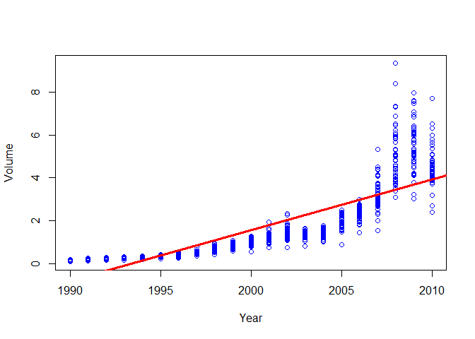

**Exercise 4**

1.  On average, the fraction of the available observations would be
    10%/2\*2=10%.

2.  On average,the fraction of the available observations would be
    10%\*10%=1%

3.  On average, the fraction of the available observations would be
    0.1^{100}.

4.  When p gets larger, the number of available observations decrease
    exponentially near any given test observation, which makes it
    difficult to find the best estimators for KNN.

5.  Suppose we want to set the length of each side as l, if we want to
    have l^{p}=0.1 we have to make l=sqrt\[p\]{0.1}. So:

when p=1, the length is 0.1 when p=2, the length is 0.1^{1/2}=0.316 when
p=100, the length is 0.1^{1/100}=0.977

**Exercise 10**

    library(MASS)
    library(ISLR2)

    ## 
    ## Attaching package: 'ISLR2'

    ## The following object is masked from 'package:MASS':
    ## 
    ##     Boston

    library(corrplot)

    ## corrplot 0.92 loaded

    library(class)
    library(e1071)

1.  

<!-- -->

    # Numerical Summary of the data
    names(Weekly)

    ## [1] "Year"      "Lag1"      "Lag2"      "Lag3"      "Lag4"      "Lag5"     
    ## [7] "Volume"    "Today"     "Direction"

    dim(Weekly)

    ## [1] 1089    9

    summary(Weekly)

    ##       Year           Lag1               Lag2               Lag3         
    ##  Min.   :1990   Min.   :-18.1950   Min.   :-18.1950   Min.   :-18.1950  
    ##  1st Qu.:1995   1st Qu.: -1.1540   1st Qu.: -1.1540   1st Qu.: -1.1580  
    ##  Median :2000   Median :  0.2410   Median :  0.2410   Median :  0.2410  
    ##  Mean   :2000   Mean   :  0.1506   Mean   :  0.1511   Mean   :  0.1472  
    ##  3rd Qu.:2005   3rd Qu.:  1.4050   3rd Qu.:  1.4090   3rd Qu.:  1.4090  
    ##  Max.   :2010   Max.   : 12.0260   Max.   : 12.0260   Max.   : 12.0260  
    ##       Lag4               Lag5              Volume            Today         
    ##  Min.   :-18.1950   Min.   :-18.1950   Min.   :0.08747   Min.   :-18.1950  
    ##  1st Qu.: -1.1580   1st Qu.: -1.1660   1st Qu.:0.33202   1st Qu.: -1.1540  
    ##  Median :  0.2380   Median :  0.2340   Median :1.00268   Median :  0.2410  
    ##  Mean   :  0.1458   Mean   :  0.1399   Mean   :1.57462   Mean   :  0.1499  
    ##  3rd Qu.:  1.4090   3rd Qu.:  1.4050   3rd Qu.:2.05373   3rd Qu.:  1.4050  
    ##  Max.   : 12.0260   Max.   : 12.0260   Max.   :9.32821   Max.   : 12.0260  
    ##  Direction 
    ##  Down:484  
    ##  Up  :605  
    ##            
    ##            
    ##            
    ## 

    # Graphical Summary of the data
    pairs(Weekly)

    plot(Volume~Year,col='Blue',data=Weekly)
    simplelm=lm(Volume~Year,data=Weekly)
    abline(simplelm,lwd=3,col='red')

1.  

<!-- -->

    # Logistic Regression
    glm_fit<-glm(
      Direction ~ Lag1+Lag2+Lag3+Lag4+Lag5+Volume,
      data=Weekly,family = binomial
    )
    summary(glm_fit)

    ## 
    ## Call:
    ## glm(formula = Direction ~ Lag1 + Lag2 + Lag3 + Lag4 + Lag5 + 
    ##     Volume, family = binomial, data = Weekly)
    ## 
    ## Deviance Residuals: 
    ##     Min       1Q   Median       3Q      Max  
    ## -1.6949  -1.2565   0.9913   1.0849   1.4579  
    ## 
    ## Coefficients:
    ##             Estimate Std. Error z value Pr(>|z|)   
    ## (Intercept)  0.26686    0.08593   3.106   0.0019 **
    ## Lag1        -0.04127    0.02641  -1.563   0.1181   
    ## Lag2         0.05844    0.02686   2.175   0.0296 * 
    ## Lag3        -0.01606    0.02666  -0.602   0.5469   
    ## Lag4        -0.02779    0.02646  -1.050   0.2937   
    ## Lag5        -0.01447    0.02638  -0.549   0.5833   
    ## Volume      -0.02274    0.03690  -0.616   0.5377   
    ## ---
    ## Signif. codes:  0 '***' 0.001 '**' 0.01 '*' 0.05 '.' 0.1 ' ' 1
    ## 
    ## (Dispersion parameter for binomial family taken to be 1)
    ## 
    ##     Null deviance: 1496.2  on 1088  degrees of freedom
    ## Residual deviance: 1486.4  on 1082  degrees of freedom
    ## AIC: 1500.4
    ## 
    ## Number of Fisher Scoring iterations: 4

The lag2 seems to be statitically significant than the other features
here, which is 0.0296, meaning that the direction is related to the
response Direction. The coeffient is also positive meaning that if the
market has a positive return on two days ago, it is more likely to go up
today.

1.  

<!-- -->

    # Produce Confusion Matrix
    glm_probs<-predict(glm_fit,type="response")
    contrasts(Weekly$Direction)

    ##      Up
    ## Down  0
    ## Up    1

    glm_pred<-rep("Down",1089)
    glm_pred[glm_probs>0.5]='Up'
    table(glm_pred,Weekly$Direction)

    ##         
    ## glm_pred Down  Up
    ##     Down   54  48
    ##     Up    430 557

    # Calculate the correct predictions
    mean(glm_pred==Weekly$Direction)

    ## [1] 0.5610652

The confusion matrix explain:

The diagonal elements indicate correct predictions while the off-diagnal
represent incorrect predictions. The model correctly predicted that the
market would go up on 557 days and that it would go down 54 days. The
total is 557+54=611 days of correct prediction.

The overall fraction is 56.1%, meaning that the logistic regression
correctly predicted the market 56.1% of the time. The training error
rate is 1-56.1%=43.9%. The true positive is relatively high and so as
the false positive rate. Most of the time, our model is predicting that
the market is going up, while it is always making an error by predicting
the uptrend.

Since we are training on the same data set, it may underestimate the
test error.

1.  

<!-- -->

    # Set up train data from 1990 to 2008
    train<-Weekly$Year>=1990 & Weekly$Year<=2008
    weekly_train<-Weekly[train,]
    weekly_test<-Weekly[!train,]
    dim(weekly_test)

    ## [1] 104   9

    # Use logistic regression to fit the train data

    train_fit<-glm(Direction~Lag2, data=weekly_train,family = binomial)

    # Produce confusion matrix for new fit data

    train_probs<-predict(train_fit,weekly_test,type="response")
    train_pred<-rep("Down",104)
    train_pred[train_probs>0.5]='Up'

    table(train_pred,weekly_test$Direction)

    ##           
    ## train_pred Down Up
    ##       Down    9  5
    ##       Up     34 56

    mean(train_pred==weekly_test$Direction)

    ## [1] 0.625

The overall fraction of correct predictions is 62.5%.

1.  Linear Discriminant Analysis

<!-- -->

    # Fit LDA model according to d
    lda_fit<-lda(Direction~Lag2,data=weekly_train)
    lda_pred<-predict(lda_fit,newdata=weekly_test,type='response')
    lda_class<-lda_pred$class

    # Create confusion matrix
    table(lda_class,weekly_test$Direction)

    ##          
    ## lda_class Down Up
    ##      Down    9  5
    ##      Up     34 56

    # Calculate accuracy
    mean(lda_class==weekly_test$Direction)

    ## [1] 0.625

From calculating accuracy, we can see that the accuracy of LDA is 62.5%.

1.  Quadric Discriminant Analysis

<!-- -->

    # Fit QDA model according to d
    qda_fit<-qda(Direction~Lag2,data=weekly_train)
    qda_pred<-predict(qda_fit,newdata=weekly_test,type='response')
    qda_class<-qda_pred$class

    # Create confusion matrix
    table(qda_class,weekly_test$Direction)

    ##          
    ## qda_class Down Up
    ##      Down    0  0
    ##      Up     43 61

    # Calculate accuracy
    mean(qda_class==weekly_test$Direction)

    ## [1] 0.5865385

From calculating accuracy, we can see that the accuracy of QDA is 58.7%.

1.  KNN when k=1

<!-- -->

    # Fit KNN
    set.seed(123)
    train_x<-cbind(weekly_train$Lag2)
    test_x<-cbind(weekly_test$Lag2)
    train_direction<-weekly_train$Direction
    test_direction<-weekly_test$Direction

    # Produce confusion matrix
    knn_pred<-knn(train_x,test_x,train_direction,k=1)
    table(knn_pred,test_direction)

    ##         test_direction
    ## knn_pred Down Up
    ##     Down   21 29
    ##     Up     22 32

    # Check accuracy
    mean(knn_pred==test_direction)

    ## [1] 0.5096154

From calculating accuracy, we can see that the accuracy of KNN is
50.96%.

1.  Naive Bayes

<!-- -->

    # Fit Naive Bayes
    nb_fit<-naiveBayes(Direction~Lag2,weekly_train)
    nb_pred<-predict(nb_fit,weekly_test)

    # Create confusion matrix
    table(nb_pred,weekly_test$Direction)

    ##        
    ## nb_pred Down Up
    ##    Down    0  0
    ##    Up     43 61

    # Calculate accuracy
    mean(nb_pred==weekly_test$Direction)

    ## [1] 0.5865385

From calculating accuracy, we can see that the accuracy of Naive Bayes
is 58.7%.

1.  

From the calculation above, we can see that the logistic regression and
linear discrimnant analysis provide the best results on this data, which
are both 62.5%.

1.  Experiment with different combinations for each methods

Adding Volume as one predictor combine with Lag2 to test different
models

Logistic regression

    # Logistic regression
    glm_fit_2<-glm(Direction~Lag2+Volume,data=weekly_train,family = binomial)
    glm_pred_2<-predict(glm_fit_2,weekly_test,type='response')

    train_pred_2<-rep("Down",104)
    train_pred_2[glm_pred_2>0.5]='Up'

    table(train_pred_2,weekly_test$Direction)

    ##             
    ## train_pred_2 Down Up
    ##         Down   20 25
    ##         Up     23 36

    mean(train_pred_2==weekly_test$Direction)

    ## [1] 0.5384615

From calculating accuracy, we can see that the accuracy of Naive Bayes
is 53.8%.

LDA

    # LDA

    lda_fit_2<-lda(Direction~Lag2+Volume,data=weekly_train)
    lda_pred_2<-predict(lda_fit_2,newdata=weekly_test,type='response')
    lda_class_2<-lda_pred_2$class

    # Create confusion matrix
    table(lda_class_2,weekly_test$Direction)

    ##            
    ## lda_class_2 Down Up
    ##        Down   20 25
    ##        Up     23 36

    # Calculate accuracy
    mean(lda_class_2==weekly_test$Direction)

    ## [1] 0.5384615

From calculating accuracy, we can see that the accuracy of Naive Bayes
is 53.8%.

QDA

    # QDA

    qda_fit_2<-qda(Direction~Lag2+Volume,data=weekly_train)
    qda_pred_2<-predict(qda_fit_2,newdata=weekly_test,type='response')
    qda_class_2<-qda_pred_2$class

    # Create confusion matrix
    table(qda_class_2,weekly_test$Direction)

    ##            
    ## qda_class_2 Down Up
    ##        Down   32 44
    ##        Up     11 17

    # Calculate accuracy
    mean(qda_class_2==weekly_test$Direction)

    ## [1] 0.4711538

From calculating accuracy, we can see that the accuracy of Naive Bayes
is 47.1%.

KNN

    # Fit KNN
    set.seed(123)
    train_x_2<-cbind(weekly_train$Lag2,weekly_train$Volume)
    test_x_2<-cbind(weekly_test$Lag2,weekly_test$Volume)

    # Produce confusion matrix
    knn_pred_2<-knn(train_x_2,test_x_2,train_direction,k=1)
    table(knn_pred_2,test_direction)

    ##           test_direction
    ## knn_pred_2 Down Up
    ##       Down   26 29
    ##       Up     17 32

    # Check accuracy
    mean(knn_pred_2==test_direction)

    ## [1] 0.5576923

From calculating accuracy, we can see that the accuracy of Naive Bayes
is 55.8%.

Naive Bayes

    # Naive Bayes
    nb_fit_2<-naiveBayes(Direction~Lag2+Volume,weekly_train)
    nb_pred_2<-predict(nb_fit_2,weekly_test)

    # Create confusion matrix
    table(nb_pred_2,weekly_test$Direction)

    ##          
    ## nb_pred_2 Down Up
    ##      Down   43 57
    ##      Up      0  4

    # Calculate accuracy
    mean(nb_pred_2==weekly_test$Direction)

    ## [1] 0.4519231

From calculating accuracy, we can see that the accuracy of Naive Bayes
is 45.2%.

**Summary** From adding the volume as another predictor, we find out
that KNN becomes the best fit model with most accuracy in this
situation.
