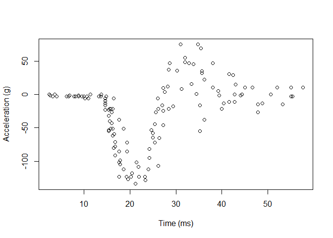
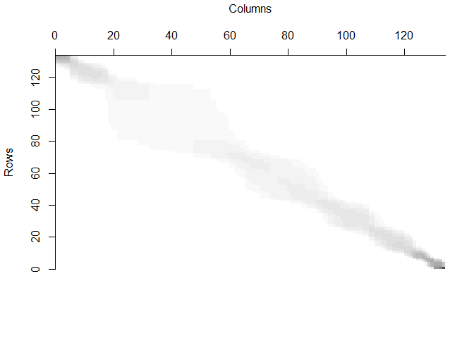
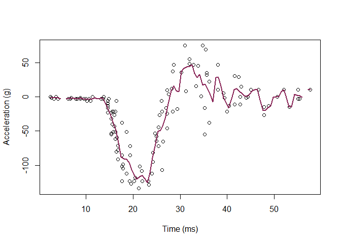
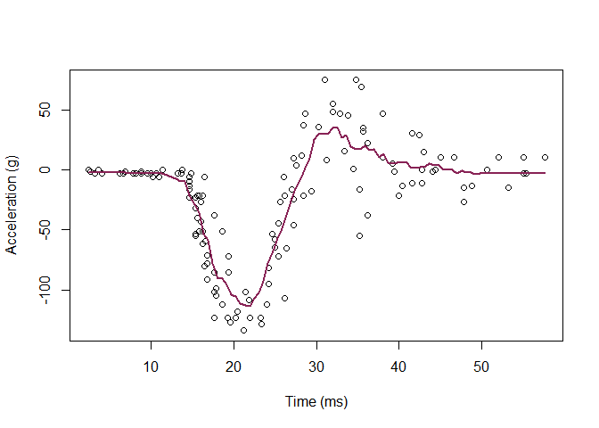
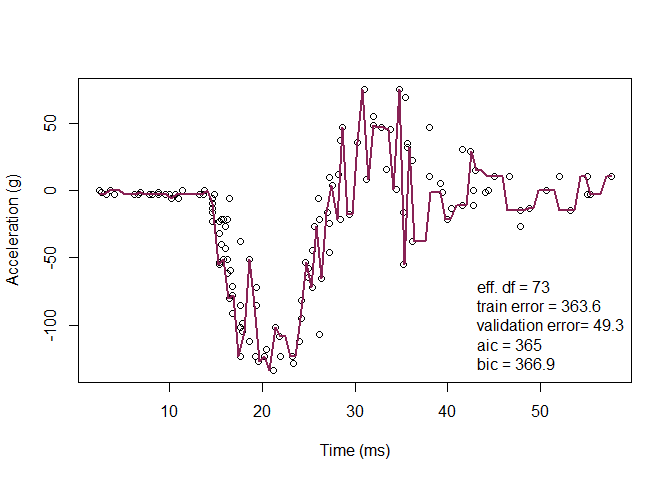
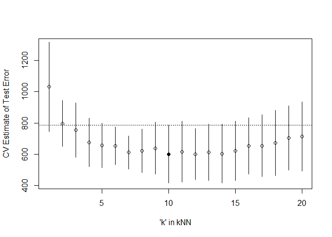

# Original Code

    library('MASS') ## for 'mcycle'
    library('manipulate') ## for 'manipulate'
    library(caret)

    ## Loading required package: ggplot2

    ## Loading required package: lattice

    y <- mcycle$accel
    x <- matrix(mcycle$times, length(mcycle$times), 1)

    plot(x, y, xlab="Time (ms)", ylab="Acceleration (g)")

    ## Epanechnikov kernel function
    ## x  - n x p matrix of training inputs
    ## x0 - 1 x p input where to make prediction
    ## lambda - bandwidth (neighborhood size)
    kernel_epanechnikov <- function(x, x0, lambda=1) {
      d <- function(t)
        ifelse(t <= 1, 3/4*(1-t^2), 0)
      z <- t(t(x) - x0)
      d(sqrt(rowSums(z*z))/lambda)
    }

    ## k-NN kernel function
    ## x  - n x p matrix of training inputs
    ## x0 - 1 x p input where to make prediction
    ## k  - number of nearest neighbors
    kernel_k_nearest_neighbors <- function(x, x0, k=1) {
      ## compute distance betwen each x and x0
      z <- t(t(x) - x0)
      d <- sqrt(rowSums(z*z))

      ## initialize kernel weights to zero
      w <- rep(0, length(d))
      
      ## set weight to 1 for k nearest neighbors
      w[order(d)[1:k]] <- 1
      
      return(w)
    }

    ## Make predictions using the NW method
    ## y  - n x 1 vector of training outputs
    ## x  - n x p matrix of training inputs
    ## x0 - m x p matrix where to make predictions
    ## kern  - kernel function to use
    ## ... - arguments to pass to kernel function
    nadaraya_watson <- function(y, x, x0, kern, ...) {
      k <- t(apply(x0, 1, function(x0_) {
        k_ <- kern(x, x0_, ...)
        k_/sum(k_)
      }))
      yhat <- drop(k %*% y)
      attr(yhat, 'k') <- k
      return(yhat)
    }

    ## Helper function to view kernel (smoother) matrix
    matrix_image <- function(x) {
      rot <- function(x) t(apply(x, 2, rev))
      cls <- rev(gray.colors(20, end=1))
      image(rot(x), col=cls, axes=FALSE)
      xlb <- pretty(1:ncol(x))
      xat <- (xlb-0.5)/ncol(x)
      ylb <- pretty(1:nrow(x))
      yat <- (ylb-0.5)/nrow(x)
      axis(3, at=xat, labels=xlb)
      axis(2, at=yat, labels=ylb)
      mtext('Rows', 2, 3)
      mtext('Columns', 3, 3)
    }

    ## Compute effective df using NW method
    ## y  - n x 1 vector of training outputs
    ## x  - n x p matrix of training inputs
    ## kern  - kernel function to use
    ## ... - arguments to pass to kernel function
    effective_df <- function(y, x, kern, ...) {
      y_hat <- nadaraya_watson(y, x, x,
        kern=kern, ...)
      sum(diag(attr(y_hat, 'k')))
    }

    ## loss function
    ## y    - train/test y
    ## yhat - predictions at train/test x
    loss_squared_error <- function(y, yhat)
      (y - yhat)^2

    ## test/train error
    ## y    - train/test y
    ## yhat - predictions at train/test x
    ## loss - loss function
    error <- function(y, yhat, loss=loss_squared_error)
      mean(loss(y, yhat))

    ## AIC
    ## y    - training y
    ## yhat - predictions at training x
    ## d    - effective degrees of freedom
    aic <- function(y, yhat, d)
      error(y, yhat) + 2/length(y)*d

    ## BIC
    ## y    - training y
    ## yhat - predictions at training x
    ## d    - effective degrees of freedom
    bic <- function(y, yhat, d)
      error(y, yhat) + log(length(y))/length(y)*d

    ## make predictions using NW method at training inputs
    y_hat <- nadaraya_watson(y, x, x,
      kernel_epanechnikov, lambda=5)

    ## view kernel (smoother) matrix
    matrix_image(attr(y_hat, 'k'))

    ## compute effective degrees of freedom
    edf <- effective_df(y, x, kernel_epanechnikov, lambda=5)
    aic(y, y_hat, edf)

    ## [1] 677.1742

    bic(y, y_hat, edf)

    ## [1] 677.3629

    ## create a grid of inputs 
    x_plot <- matrix(seq(min(x),max(x),length.out=100),100,1)

    ## make predictions using NW method at each of grid points
    y_hat_plot <- nadaraya_watson(y, x, x_plot,
      kernel_epanechnikov, lambda=1)

    ## plot predictions
    plot(x, y, xlab="Time (ms)", ylab="Acceleration (g)")
    lines(x_plot, y_hat_plot, col="#882255", lwd=2) 

    ## how does k affect shape of predictor and eff. df using k-nn kernel ?
    # manipulate({
    #   ## make predictions using NW method at training inputs
    #   y_hat <- nadaraya_watson(y, x, x,
    #     kern=kernel_k_nearest_neighbors, k=k_slider)
    #   edf <- effective_df(y, x, 
    #     kern=kernel_k_nearest_neighbors, k=k_slider)
    #   aic_ <- aic(y, y_hat, edf)
    #   bic_ <- bic(y, y_hat, edf)
    #   y_hat_plot <- nadaraya_watson(y, x, x_plot,
    #     kern=kernel_k_nearest_neighbors, k=k_slider)
    #   plot(x, y, xlab="Time (ms)", ylab="Acceleration (g)")
    #   legend('topright', legend = c(
    #     paste0('eff. df = ', round(edf,1)),
    #     paste0('aic = ', round(aic_, 1)),
    #     paste0('bic = ', round(bic_, 1))),
    #     bty='n')
    #   lines(x_plot, y_hat_plot, col="#882255", lwd=2) 
    # }, k_slider=slider(1, 10, initial=3, step=1))

# Question 1: Split the data into 75% and 25%

    library(dplyr)

    ## 
    ## Attaching package: 'dplyr'

    ## The following object is masked from 'package:MASS':
    ## 
    ##     select

    ## The following objects are masked from 'package:stats':
    ## 
    ##     filter, lag

    ## The following objects are masked from 'package:base':
    ## 
    ##     intersect, setdiff, setequal, union

    set.seed(123)
    train<-sample_frac(mcycle,size=0.75)
    test<-anti_join(mcycle,train)

    ## Joining, by = c("times", "accel")

    train_x<-matrix(train$times)
    test_x<-matrix(test$times)
    train_y<-train$accel
    test_y<-test$accel

    class(train_x)

    ## [1] "matrix" "array"

# Question 2: Using the mcycle data, consider predicting the mean acceleration as a function of time. Use the Nadaraya-Watson method with the k-NN kernel function to create a series of prediction models by varying the tuning parameter over a sequence of values.

    ## plot predictions
    plot(x, y, xlab="Time (ms)", ylab="Acceleration (g)")
    lines(x_plot, y_hat_plot, col="#882255", lwd=2)

    # Use manipulate to check parameters
    #manipulate({
     # y_hat_plot<- nadaraya_watson(y, x, x_plot,
        #kern=kernel_k_nearest_neighbors, k=k_slider)
     # plot(x, y, xlab="Time (ms)", ylab="Acceleration (g)")
      #lines(x_plot, y_hat_plot, col="#882255", lwd=2) 
    #}, k_slider=slider(1, 100, initial=1, step=1))

    # Set k=11
    y_hat_12<- nadaraya_watson(y, x, x_plot,
        kern=kernel_k_nearest_neighbors, k=11)

    plot(x, y, xlab="Time (ms)", ylab="Acceleration (g)")
    lines(x_plot, y_hat_12, col="#882255", lwd=2)

I used manipulate to find the best k that I think would fit the model
when k is 11.

# Question 3: With the squared-error loss function, compute and plot the training error, AIC, BIC, and validation error (using the validation data) as functions of the tuning parameter.

    # Train Error
    y_hat<-nadaraya_watson(train_y,train_x,train_x,kern=kernel_k_nearest_neighbors,k=1)
    d<-effective_df(train_y, train_x, kern=kernel_k_nearest_neighbors,k=1)
    aic_test<-aic(train_y,y_hat,d=d)
    bic_test<-bic(train_y,y_hat,d=d)
    train_err<-error(train_y,y_hat)

    #Validation Error
    y_hat_test<-nadaraya_watson(test_y,test_x,test_x,kern=kernel_k_nearest_neighbors,k=1)
    validation_err<-error(test_y,y_hat_test)

    # Plot
    y_hat_plot<-nadaraya_watson(train_y, train_x, x_plot,
        kern=kernel_k_nearest_neighbors, k=1)

    plot(x, y, xlab="Time (ms)", ylab="Acceleration (g)")
    legend('bottomright', legend = c(
      paste0('eff. df = ', round(d,1)),
      paste0('train error = ', round(train_err,1)),
      paste0('validation error= ', round(validation_err,1)),
      paste0('aic = ', round(aic_test, 1)),
      paste0('bic = ', round(bic_test, 1))),
      bty='n')
    lines(x_plot, y_hat_plot, col="#882255", lwd=2) 

    # Manipulate
    #manipulate({
      #y_hat<-nadaraya_watson(train_y,train_x,train_x,kern=kernel_k_nearest_neighbors,k=k_slider)
      #d<-effective_df(train_y, train_x, kern=kernel_k_nearest_neighbors, k=k_slider)
      #aic_test<-aic(train_y,y_hat,d)
      #bic_test<-bic(train_y,y_hat,d)
      #train_err<-error(train_y,y_hat)
      #y_hat_test<-nadaraya_watson(test_y,test_x,test_x,kern=kernel_k_nearest_neighbors,k=k_slider)
      #validation_err<-error(test_y,y_hat_test)
     # y_hat_plot<-nadaraya_watson(train_y, train_x, x_plot,kern=kernel_k_nearest_neighbors, k=k_slider)
      #plot(x, y, xlab="Time (ms)", ylab="Acceleration (g)")
     #legend('bottomright', legend = c(
        #paste0('eff. df = ', round(d,1)),
        #paste0('train error = ', round(train_err,1)),
       # paste0('validation error= ', round(validation_err,1)),
       # paste0('aic = ', round(aic_test, 1)),
       # paste0('bic = ', round(bic_test, 1))),
       # bty='n')
      #lines(x_plot, y_hat_plot, col="#882255", lwd=2) 
    #},k_slider=slider(1,10,initial=1,step=1))

After using manipulation, I found out the validation error is lowest
when it is at k=1.

# Question 4: For each value of the tuning parameter, Perform 5-fold cross-validation using the combined training and validation data. This results in 5 estimates of test error per tuning parameter value.

    set.seed(123)
    fold_y <-createFolds(mcycle$accel,k=5)
    print(fold_y)

    ## $Fold1
    ##  [1]   5   9  21  23  31  35  36  40  42  46  47  48  54  55  56  57  80  91 100
    ## [20] 107 110 115 122 123 127 129
    ## 
    ## $Fold2
    ##  [1]   6  15  17  24  27  28  34  41  59  60  65  69  70  71  73  77  79  83  92
    ## [20]  94  96  97 105 117 125 126 133
    ## 
    ## $Fold3
    ##  [1]   2   3  10  11  14  26  29  30  32  39  53  61  62  63  68  81  86  88  89
    ## [20]  95 102 108 113 120 121 130 131
    ## 
    ## $Fold4
    ##  [1]   1   8  12  18  19  20  38  43  45  49  58  64  72  74  75  82  84  90 101
    ## [20] 103 109 112 116 118 119 128
    ## 
    ## $Fold5
    ##  [1]   4   7  13  16  22  25  33  37  44  50  51  52  66  67  76  78  85  87  93
    ## [20]  98  99 104 106 111 114 124 132

    sapply(fold_y, length)

    ## Fold1 Fold2 Fold3 Fold4 Fold5 
    ##    26    27    27    26    27

    cvknnreg <- function(kNN = 10, flds=fold_y) {
      cverr <- rep(NA, length(flds))
      for(tst_idx in 1:length(flds)) { ## for each fold
        
        ## get training and testing data
        mcycle_trn <- mcycle[-flds[[tst_idx]],]
        mcycle_tst <- mcycle[ flds[[tst_idx]],]
        
        ## fit kNN model to training data
        knn_fit <- knnreg(accel~times,
                          k=kNN, data=mcycle_trn)
        
        ## compute test error on testing data
        pre_tst <- predict(knn_fit, mcycle_tst)
        cverr[tst_idx] <- mean((mcycle_tst$accel - pre_tst)^2)
      }
      return(cverr)
    }

    ## Compute 5-fold CV for kNN = 1:20
    cverrs <- sapply(1:20, cvknnreg)
    print(cverrs) ## rows are k-folds (1:5), cols are kNN (1:20)

    ##           [,1]     [,2]     [,3]     [,4]     [,5]     [,6]     [,7]     [,8]
    ## [1,] 1275.8519 956.0137 889.1726 795.5141 740.5003 683.8855 633.3807 646.4667
    ## [2,] 1073.4663 690.8665 534.0449 515.4849 471.9864 531.0455 488.3021 487.0412
    ## [3,]  618.7575 713.1075 754.6251 801.8319 816.4272 817.5123 673.4736 757.8141
    ## [4,]  885.9828 663.8583 637.9351 496.0712 541.2310 539.1940 517.0917 466.8336
    ## [5,] 1304.4750 958.1521 959.6493 765.4793 705.9491 692.8515 742.1920 745.8334
    ##          [,9]    [,10]    [,11]    [,12]    [,13]    [,14]    [,15]    [,16]
    ## [1,] 598.1053 566.1476 507.2657 512.8915 546.4471 553.2352 566.5924 583.1804
    ## [2,] 491.3374 413.7787 435.3262 448.5622 439.3968 426.0129 440.7610 513.6491
    ## [3,] 796.5510 823.9328 826.3368 784.1874 796.9647 797.6993 846.7896 877.8859
    ## [4,] 473.4989 436.8617 478.4861 485.5396 466.0641 435.2313 451.6150 479.0830
    ## [5,] 826.4967 759.6062 830.1758 770.1037 811.5501 805.1709 798.6712 812.0001
    ##         [,17]    [,18]    [,19]    [,20]
    ## [1,] 573.5502 591.6904 632.1870 642.2565
    ## [2,] 518.7348 505.7740 567.3164 588.9182
    ## [3,] 930.6911 951.0611 946.7080 975.8086
    ## [4,] 457.4089 479.1642 475.3609 447.2364
    ## [5,] 788.4958 829.7101 890.3531 905.2411

    cverrs_mean <- apply(cverrs, 2, mean)
    cverrs_sd   <- apply(cverrs, 2, sd)

# Question 5: Plot the CV-estimated test error (average of the five estimates from each fold) as a function of the tuning parameter. Add vertical line segments to the figure (using the segments function in R) that represent one “standard error” of the CV-estimated test error (standard deviation of the five estimates from each fold).

    plot(x=1:20, y=cverrs_mean, 
         ylim=range(cverrs),
         xlab="'k' in kNN", ylab="CV Estimate of Test Error")
    segments(x0=1:20, x1=1:20,
             y0=cverrs_mean-cverrs_sd,
             y1=cverrs_mean+cverrs_sd)
    best_idx <- which.min(cverrs_mean)
    points(x=best_idx, y=cverrs_mean[best_idx], pch=20)
    abline(h=cverrs_mean[best_idx] + cverrs_sd[best_idx], lty=3)

# Question 6: Interpret the resulting figures and select a suitable value for the tuning parameter.

The resulting figure shows that the minimum test error happens when
k=10, and also when k is larger than 10 the test error gradually
increases, so I would choose k=10 as the tuning parameter.
