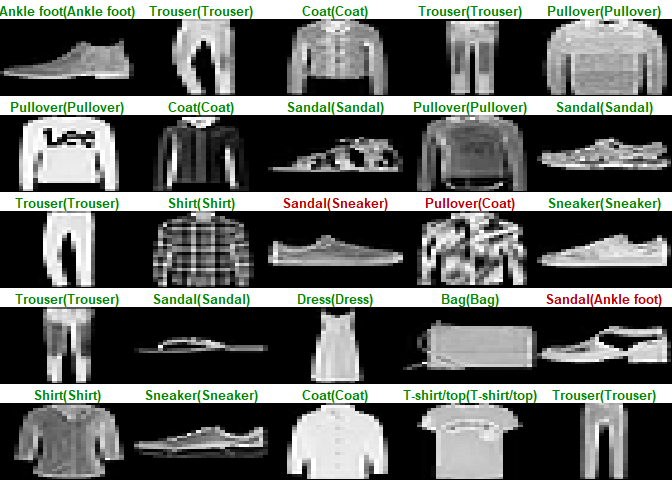

    library(keras)

    ## Warning: package 'keras' was built under R version 4.1.3

    library(tensorflow)

    ## Warning: package 'tensorflow' was built under R version 4.1.3

    library(dplyr)

    ## 
    ## Attaching package: 'dplyr'

    ## The following objects are masked from 'package:stats':
    ## 
    ##     filter, lag

    ## The following objects are masked from 'package:base':
    ## 
    ##     intersect, setdiff, setequal, union

    library(tidyr)
    library(ggplot2)

    fashion_mnist<-dataset_fashion_mnist()

    ## Loaded Tensorflow version 2.8.0

    c(train_images,train_labels)%<-% fashion_mnist$train

    c(test_images,test_labels)%<-%fashion_mnist$test

    class_names=c('T-shirt/top',"Trouser","Pullover","Dress","Coat","Sandal","Shirt","Sneaker","Bag","Ankle foot")

    image_1<-as.data.frame(train_images[1,,])
    colnames(image_1)<-seq_len(ncol(image_1))
    image_1$y<-seq_len(nrow(image_1))
    image_1<-gather(image_1,"x","value",-y)
    image_1$x<-as.integer(image_1$x)

    ggplot(image_1,aes(x=x,y=y,fill=value))+geom_tile()+scale_fill_gradient(low="white",high="black",na.value=NA)+scale_y_reverse()+theme_minimal()+theme(panel.grid = element_blank())+theme(aspect.ratio = 1)+xlab("")+ylab("")

    train_images<-train_images/255
    test_images<-test_images/255

    par(mfcol=c(5,5))
    par(mar=c(0,0,1.5,0),xaxs="i",yaxs="i")
    for (i in 1:25){
      img<-train_images[i,,]
      img<-t(apply(img, 2, rev))
      image(1:28,1:28,img,col=gray((0:255)/255),xaxt='n',yaxt="n",main=paste(class_names[train_labels[i]+1]))
    }

Build the model

    model<-keras_model_sequential()
    model %>%
      layer_flatten(input_shape = c(28,28)) %>%
      layer_dense(units = 128,activation = "relu") %>%
      layer_dense(units = 10,activation="softmax")

Compile the model

    model %>% compile(
      optimizer="adam",
      loss="sparse_categorical_crossentropy",
      metrics=c("accuracy")
    )

Train the model

    model %>% fit(train_images,train_labels,epochs=5,verbose=2)

Evaluate Accuracy

    score<-model%>% evaluate(test_images,test_labels,verbose=0)

    predictions<-model %>% predict(test_images)

    predictions[1,]

    ##  [1] 1.985246e-06 2.646846e-10 2.443136e-06 3.414826e-09 2.960140e-07
    ##  [6] 1.416149e-02 9.017543e-07 1.003902e-02 4.826727e-06 9.757891e-01

    which.max(predictions[1,])

    ## [1] 10

    class_pred<-model %>% predict(test_images)%>% k_argmax()
    class_pred[1:20]

    ## tf.Tensor([9 2 1 1 6 1 4 6 5 7 4 5 7 3 4 1 2 2 8 0], shape=(20,), dtype=int64)

    test_labels

    ##     [1] 9 2 1 1 6 1 4 6 5 7 4 5 7 3 4 1 2 4 8 0 2 5 7 9 1 4 6 0 9 3 8 8 3 3 8 0
    ##    [37] 7 5 7 9 6 1 3 7 6 7 2 1 2 2 4 4 5 8 2 2 8 4 8 0 7 7 8 5 1 1 2 3 9 8 7 0
    ##    [73] 2 6 2 3 1 2 8 4 1 8 5 9 5 0 3 2 0 6 5 3 6 7 1 8 0 1 4 2 3 6 7 2 7 8 5 9
    ##   [109] 9 4 2 5 7 0 5 2 8 6 7 8 0 0 9 9 3 0 8 4 1 5 4 1 9 1 8 6 2 1 2 5 1 0 0 0
    ##   [145] 1 6 1 6 2 2 4 4 1 4 5 0 4 7 9 3 7 2 3 9 0 9 4 7 4 2 0 5 2 1 2 1 3 0 9 1
    ##   [181] 0 9 3 6 7 9 9 4 4 7 1 2 1 6 3 2 8 3 6 1 1 0 2 9 2 4 0 7 9 8 4 1 8 4 1 3
    ##   [217] 1 6 7 2 8 5 2 0 7 7 6 2 7 0 7 8 9 2 9 0 5 1 4 4 5 6 9 2 6 8 6 4 2 2 9 7
    ##   [253] 6 5 5 2 8 5 2 3 0 4 8 0 0 6 3 8 9 6 1 3 0 2 3 0 8 3 7 4 0 1 6 3 0 6 6 7
    ##   [289] 5 4 5 9 5 6 5 5 1 9 8 8 3 3 6 8 0 0 2 9 7 7 1 3 6 4 2 4 9 1 6 4 8 2 6 5
    ##   [325] 4 6 7 7 7 3 3 7 0 7 1 3 7 2 2 3 4 0 3 1 6 1 9 4 9 9 1 7 8 3 6 0 2 4 8 0
    ##   [361] 1 2 2 4 4 7 3 2 2 5 0 7 9 4 0 9 3 9 4 2 5 0 2 3 5 8 1 6 2 6 6 4 9 5 2 0
    ##   [397] 4 6 1 2 0 9 7 0 4 4 6 6 2 1 0 6 7 2 9 4 2 1 5 4 5 3 8 5 8 4 4 8 9 8 6 2
    ##   [433] 4 4 2 4 1 6 1 3 0 9 8 8 6 5 3 1 9 5 3 3 0 1 0 2 9 2 0 6 3 4 2 0 0 3 3 8
    ##   [469] 2 8 9 4 0 7 6 4 4 9 2 9 5 9 3 7 5 7 8 1 0 0 3 4 8 9 7 9 1 2 7 0 2 0 5 7
    ##   [505] 1 8 2 2 2 2 4 2 6 1 9 8 5 1 9 1 2 8 3 8 9 2 4 2 8 8 2 0 5 8 8 5 3 9 4 3
    ##   [541] 4 4 5 1 0 1 2 0 6 9 6 1 5 1 1 1 9 3 4 5 3 6 6 6 4 6 0 5 8 3 3 4 6 7 7 8
    ##   [577] 9 0 3 8 7 6 7 9 3 4 6 6 5 0 1 1 5 9 4 6 5 7 8 1 2 9 7 7 1 0 9 3 2 9 0 7
    ##   [613] 6 8 2 7 0 2 3 8 2 2 6 9 3 0 7 8 6 2 9 4 2 6 6 8 0 4 4 4 7 5 8 4 9 1 0 5
    ##   [649] 4 4 4 0 0 4 5 6 0 4 5 4 1 3 1 1 6 4 3 8 2 8 2 7 0 4 0 8 5 0 8 2 9 0 8 9
    ##   [685] 6 4 2 9 3 4 5 0 9 5 3 6 6 8 3 3 8 1 4 0 9 7 9 4 8 9 1 6 7 3 0 2 6 7 1 0
    ##   [721] 0 8 5 2 6 6 6 4 1 5 9 0 2 1 6 5 0 0 3 3 3 8 1 1 8 5 7 7 8 7 2 0 7 3 8 0
    ##   [757] 9 7 6 1 2 6 4 8 0 6 3 6 8 4 0 8 9 2 4 5 9 1 4 4 9 2 1 7 9 5 8 1 7 7 1 1
    ##   [793] 1 6 9 5 3 8 4 2 7 4 8 3 2 4 4 7 1 4 9 3 5 8 5 4 7 2 8 5 9 3 3 6 7 1 7 3
    ##   [829] 5 4 4 5 8 3 7 1 2 6 1 9 8 2 7 1 3 7 5 9 9 1 8 2 5 7 1 9 8 1 0 0 6 1 7 1
    ##   [865] 1 5 7 1 5 2 2 3 3 1 1 4 9 4 3 7 7 0 8 9 9 6 1 3 4 0 0 5 9 2 0 5 5 1 5 7
    ##   [901] 8 7 5 3 6 4 0 4 0 6 0 2 5 5 1 2 0 9 3 7 8 6 8 3 4 7 0 7 4 8 0 3 4 4 3 4
    ##   [937] 9 0 6 4 9 1 8 1 7 5 5 6 0 2 1 0 5 4 0 0 6 7 5 0 3 5 9 6 8 0 6 4 6 2 9 6
    ##   [973] 7 7 1 4 2 6 5 3 9 9 8 8 3 0 2 4 6 6 3 2 3 5 4 9 3 4 7 7 0 3 5 5 6 0 5 9
    ##  [1009] 6 3 7 5 1 9 8 8 9 9 2 7 2 2 3 8 7 6 4 5 4 3 6 1 4 9 3 1 6 5 0 5 7 5 2 3
    ##  [1045] 3 9 6 3 6 0 4 5 0 4 9 4 6 3 6 7 0 2 1 1 4 4 8 5 9 0 1 6 5 1 4 4 8 4 7 7
    ##  [1081] 3 8 1 1 9 8 1 3 3 7 5 1 5 7 8 9 6 3 5 8 4 4 3 8 4 5 5 6 7 1 5 0 5 4 8 6
    ##  [1117] 2 1 1 7 9 6 2 7 0 4 8 2 2 6 6 6 4 9 6 8 4 5 9 0 3 9 4 9 8 7 4 2 2 5 3 7
    ##  [1153] 6 7 2 9 3 7 0 9 4 8 6 4 7 6 4 6 2 0 7 8 4 2 6 5 5 6 4 5 5 8 1 1 7 4 6 9
    ##  [1189] 6 8 7 2 2 1 2 7 7 6 9 8 5 1 1 0 2 0 9 0 1 9 6 5 5 2 0 7 0 2 0 1 3 1 3 4
    ##  [1225] 7 2 4 9 5 2 9 0 3 4 4 6 6 5 2 2 5 6 1 4 2 5 4 4 8 0 2 4 0 6 2 6 8 3 8 2
    ##  [1261] 0 4 4 8 8 4 5 2 2 3 0 1 9 0 9 1 9 6 5 2 2 7 3 8 5 0 8 0 7 5 5 9 5 0 6 0
    ##  [1297] 3 4 4 4 8 7 1 3 4 0 6 5 1 6 7 3 4 8 8 2 8 9 4 1 6 5 2 7 8 5 3 8 5 4 2 8
    ##  [1333] 9 8 4 3 3 8 8 2 0 9 4 4 8 1 3 6 1 9 2 1 6 2 7 9 4 6 0 4 4 2 4 5 0 2 8 3
    ##  [1369] 7 6 4 0 0 5 2 8 2 4 3 0 2 1 7 7 5 4 7 2 4 7 3 3 1 3 3 6 6 1 7 0 4 7 1 0
    ##  [1405] 6 5 8 4 4 7 9 5 0 7 9 5 1 2 9 5 5 3 9 9 1 2 7 8 0 1 7 2 7 1 1 5 5 6 4 5
    ##  [1441] 9 5 5 2 3 9 3 8 5 2 0 0 0 5 7 8 5 2 6 4 4 7 4 0 5 1 7 2 3 6 8 9 8 7 1 2
    ##  [1477] 3 2 9 7 5 6 1 0 7 1 2 6 9 3 6 4 4 3 0 0 6 3 6 1 3 5 6 5 0 9 1 1 8 2 9 5
    ##  [1513] 0 5 4 6 7 1 1 5 3 8 9 8 3 8 9 2 6 1 1 3 5 2 7 1 9 9 2 2 7 0 1 3 9 6 3 7
    ##  [1549] 2 8 1 8 0 7 9 8 5 8 2 6 4 0 6 5 8 3 8 7 5 7 3 7 0 7 0 2 2 5 3 5 1 1 7 7
    ##  [1585] 6 3 0 4 2 8 6 3 1 4 9 9 4 5 2 2 7 8 0 7 9 1 2 9 4 7 3 4 3 3 1 8 8 5 3 8
    ##  [1621] 6 3 4 3 2 0 2 7 3 6 8 3 9 7 3 1 7 5 8 8 2 0 6 6 4 6 5 7 0 6 6 7 7 3 9 2
    ##  [1657] 5 9 7 1 7 2 4 5 1 3 5 4 5 0 4 4 1 4 4 8 4 5 9 4 1 1 7 2 3 5 0 3 9 7 5 3
    ##  [1693] 8 8 8 9 1 1 6 3 1 6 3 4 9 9 6 0 6 9 4 9 6 6 1 8 9 2 9 4 8 0 7 2 3 6 2 5
    ##  [1729] 6 1 9 0 2 2 9 9 0 8 3 6 6 6 0 2 6 6 6 5 0 2 7 8 7 4 6 6 6 5 2 4 2 9 5 2
    ##  [1765] 6 7 0 1 9 5 5 6 7 7 5 0 5 0 8 4 7 9 8 2 4 7 3 3 7 7 7 8 4 9 5 7 6 5 7 5
    ##  [1801] 1 3 0 4 9 9 8 3 7 0 3 4 9 3 4 1 7 9 1 5 7 2 7 6 5 5 3 7 5 5 4 0 7 3 3 2
    ##  [1837] 0 2 9 9 0 3 0 8 3 8 8 4 4 1 8 2 3 5 0 4 4 3 0 0 1 0 8 4 9 0 7 0 7 7 1 5
    ##  [1873] 8 7 2 9 9 1 2 4 1 1 1 8 8 1 3 7 5 2 0 8 4 8 9 4 1 3 1 9 8 1 1 1 8 0 9 9
    ##  [1909] 7 6 0 4 2 1 1 7 9 4 2 0 3 6 6 8 1 7 2 4 2 2 3 8 7 1 8 5 5 7 7 6 6 2 9 6
    ##  [1945] 6 0 5 5 0 2 1 0 3 5 9 1 7 2 5 7 9 8 9 1 2 8 3 2 3 6 0 8 3 8 6 8 6 0 8 8
    ##  [1981] 8 2 9 3 2 0 8 5 7 0 1 1 1 9 5 1 3 3 6 0 8 2 1 3 8 8 6 7 5 6 6 7 3 3 2 4
    ##  [2017] 6 5 5 4 2 3 7 1 1 7 3 8 7 2 2 9 3 9 9 0 1 5 1 2 8 1 4 9 3 4 0 0 7 6 9 9
    ##  [2053] 5 5 7 0 9 3 3 6 9 8 4 2 2 3 9 4 3 6 7 3 0 4 8 1 8 7 3 4 5 2 2 9 1 9 4 9
    ##  [2089] 1 6 2 8 8 7 7 7 7 2 6 0 7 5 8 5 6 0 2 4 9 2 6 1 1 9 3 1 2 2 2 3 7 5 7 4
    ##  [2125] 4 4 1 2 3 5 4 2 9 1 5 9 3 6 6 4 0 1 7 7 4 6 7 7 3 0 4 3 2 7 8 7 2 8 0 8
    ##  [2161] 7 4 6 2 7 0 9 9 3 1 5 9 3 1 0 3 3 5 9 7 9 8 3 5 9 3 7 9 3 4 6 6 5 7 7 6
    ##  [2197] 3 5 3 1 1 9 4 3 9 5 5 7 2 4 9 0 2 1 9 7 1 5 0 5 5 0 3 5 0 3 3 7 4 2 6 8
    ##  [2233] 5 9 2 1 0 5 5 8 5 3 7 4 4 3 9 6 0 0 9 1 4 3 1 5 3 8 5 1 1 2 9 4 0 5 2 8
    ##  [2269] 0 2 9 8 2 4 8 3 8 0 2 0 0 4 8 5 4 9 0 9 5 8 6 9 1 2 7 2 1 6 6 0 6 5 0 4
    ##  [2305] 8 5 5 2 0 3 8 6 3 1 9 2 9 7 3 6 4 8 3 4 8 5 6 8 3 3 1 4 2 0 4 9 0 2 1 9
    ##  [2341] 9 8 1 8 8 3 3 3 8 5 9 6 6 8 7 0 3 0 0 0 5 7 5 0 7 9 1 6 4 8 9 3 5 6 0 4
    ##  [2377] 4 7 8 9 1 8 2 5 5 3 1 1 8 8 3 0 7 0 1 8 1 6 4 9 8 9 8 8 6 9 1 8 4 2 7 7
    ##  [2413] 0 5 1 1 0 6 4 3 0 4 3 5 1 6 3 3 4 4 5 6 9 8 3 3 1 0 2 1 4 4 4 8 4 9 0 9
    ##  [2449] 9 5 0 6 0 5 0 3 9 8 3 6 1 9 4 1 6 4 5 4 1 6 8 5 9 4 5 3 8 8 1 0 6 8 9 0
    ##  [2485] 5 6 2 4 9 3 2 6 8 5 9 2 3 1 6 3 6 2 7 2 1 2 0 3 0 4 8 5 0 8 5 2 7 8 1 5
    ##  [2521] 9 8 0 9 0 9 3 9 5 7 9 6 0 7 1 5 5 9 5 4 6 2 4 5 9 7 4 2 2 9 9 6 2 1 3 7
    ##  [2557] 1 8 7 9 1 8 9 3 7 7 7 1 7 4 4 0 2 4 5 2 8 9 6 8 6 0 7 7 5 0 1 9 6 0 4 9
    ##  [2593] 2 2 6 7 1 0 5 0 7 2 8 6 3 6 1 7 4 8 7 4 1 7 8 2 4 4 4 4 1 8 6 7 2 9 4 5
    ##  [2629] 0 6 3 8 8 2 0 7 2 4 0 3 1 0 8 1 7 7 2 6 3 1 2 7 0 0 0 6 2 7 2 8 3 6 3 0
    ##  [2665] 9 7 3 5 4 9 6 4 5 0 6 8 4 0 4 4 0 4 1 6 4 3 7 1 3 6 4 1 1 5 6 3 8 3 4 1
    ##  [2701] 7 4 9 8 8 4 5 5 6 7 3 9 1 0 5 3 7 0 1 1 8 3 2 0 5 9 6 3 8 1 0 4 6 2 4 8
    ##  [2737] 3 4 2 1 9 1 7 9 5 7 6 1 5 8 8 2 6 4 6 3 1 6 4 0 3 9 8 4 0 8 4 3 9 7 1 1
    ##  [2773] 7 5 1 9 4 4 2 4 8 6 7 1 3 0 7 3 5 8 1 4 2 3 4 8 8 8 4 8 1 8 9 3 0 6 0 2
    ##  [2809] 9 7 3 7 0 1 3 5 9 3 0 5 0 5 8 7 3 6 2 8 0 0 9 3 0 5 8 1 1 2 6 6 6 8 6 6
    ##  [2845] 3 3 9 5 4 3 3 1 8 1 5 2 6 0 7 9 3 2 7 1 7 6 1 6 2 6 6 7 0 4 9 3 2 5 0 8
    ##  [2881] 6 2 6 7 4 2 1 1 0 3 5 5 2 6 2 1 8 0 3 4 3 4 2 9 2 8 9 6 2 0 6 4 5 4 7 8
    ##  [2917] 1 6 3 4 2 9 4 3 5 1 2 6 0 1 1 0 2 6 9 9 0 1 2 4 6 7 6 1 1 7 7 8 7 6 5 1
    ##  [2953] 7 0 0 9 2 1 6 2 2 5 8 5 2 7 8 4 0 9 0 8 1 3 8 2 8 2 0 6 3 8 7 8 2 6 6 6
    ##  [2989] 0 4 5 3 4 1 1 9 7 0 6 2 1 4 2 7 7 1 8 3 8 7 9 8 7 2 7 9 7 2 2 3 6 3 3 9
    ##  [3025] 1 1 4 8 0 9 7 5 2 8 8 3 6 3 0 8 2 2 5 9 2 6 8 3 2 8 3 3 1 1 3 0 1 8 4 1
    ##  [3061] 5 8 1 5 8 0 7 8 7 5 9 5 5 3 0 7 8 4 5 1 6 4 2 4 4 7 7 9 7 2 5 8 5 8 5 3
    ##  [3097] 0 9 7 2 0 6 8 4 0 7 3 7 6 8 4 7 0 0 4 0 6 7 8 1 3 8 1 7 3 6 1 1 6 6 9 8
    ##  [3133] 0 8 2 7 7 1 3 0 3 0 7 8 7 6 5 2 6 7 5 5 8 9 7 3 2 4 8 3 9 5 7 6 2 6 7 3
    ##  [3169] 8 5 1 8 9 2 6 1 4 2 7 4 0 4 4 8 9 7 9 2 6 8 2 6 0 6 3 4 1 5 6 7 5 0 7 6
    ##  [3205] 2 0 5 1 1 3 7 3 8 8 7 5 9 9 5 5 4 0 7 1 4 6 0 9 9 4 6 8 6 5 7 8 0 2 7 6
    ##  [3241] 2 4 8 1 0 4 8 0 7 5 8 7 7 5 5 2 7 6 2 2 0 3 6 2 0 3 9 4 5 4 4 1 2 5 7 0
    ##  [3277] 5 0 2 5 0 4 8 0 2 7 2 7 2 3 4 7 1 2 3 4 2 2 3 9 9 2 8 0 4 0 0 1 9 3 9 0
    ##  [3313] 8 3 9 4 7 9 1 5 8 1 3 6 2 4 8 6 3 3 0 0 0 3 6 1 6 8 6 7 3 0 0 5 8 8 8 6
    ##  [3349] 1 0 8 7 8 5 8 7 0 7 2 7 1 5 5 8 3 2 8 5 9 9 2 0 6 7 1 8 8 8 7 2 0 9 7 9
    ##  [3385] 6 9 4 1 4 7 2 5 2 6 2 9 0 7 1 9 7 6 5 3 8 4 9 3 9 5 7 5 1 3 3 6 6 7 5 3
    ##  [3421] 5 5 8 7 7 4 6 5 5 6 4 8 3 0 9 2 3 2 2 7 4 0 7 1 4 8 1 4 7 8 2 0 7 2 0 2
    ##  [3457] 2 2 2 3 0 5 2 3 2 8 0 0 8 4 6 4 8 3 5 1 3 9 1 4 9 6 7 4 0 0 2 5 6 2 5 6
    ##  [3493] 5 1 7 9 2 6 7 3 0 2 8 1 0 9 9 7 8 4 6 9 7 7 5 8 8 7 5 3 5 5 0 8 9 7 2 1
    ##  [3529] 4 7 1 0 2 3 2 2 9 4 7 7 0 5 0 8 8 6 8 5 6 0 7 3 0 2 2 5 2 0 7 7 7 1 5 2
    ##  [3565] 1 8 5 2 4 8 7 7 6 7 1 0 9 5 3 9 3 5 0 7 4 2 0 1 6 5 9 3 2 8 5 7 3 1 2 0
    ##  [3601] 8 1 8 5 6 9 3 3 8 0 4 2 0 6 4 2 3 4 5 9 1 1 9 4 7 6 4 1 0 0 7 7 0 7 8 0
    ##  [3637] 5 6 4 4 8 9 7 4 9 5 3 7 2 4 1 9 7 8 1 3 9 3 6 7 8 6 5 6 7 9 9 7 0 6 2 3
    ##  [3673] 4 2 9 5 3 9 2 8 8 6 0 4 1 9 3 3 5 1 5 5 9 2 8 5 5 9 5 4 6 7 3 5 4 2 3 9
    ##  [3709] 4 8 1 9 2 6 2 4 8 8 7 7 3 9 3 9 6 8 2 6 9 0 4 4 5 7 0 4 6 4 1 3 1 6 7 8
    ##  [3745] 8 9 7 0 5 7 3 6 0 4 0 3 6 8 8 8 0 2 3 2 8 8 1 4 1 1 6 3 2 2 8 0 0 4 1 3
    ##  [3781] 2 7 0 6 7 9 9 6 7 0 9 9 8 4 8 3 4 0 9 6 6 4 3 8 4 3 6 9 6 4 7 4 7 8 8 2
    ##  [3817] 2 8 8 0 1 5 8 9 8 7 1 0 3 6 6 0 9 3 9 9 1 5 9 4 1 7 0 1 0 5 3 8 8 4 1 7
    ##  [3853] 0 5 0 4 1 7 1 7 9 6 3 9 6 2 5 3 5 8 8 2 4 7 7 4 6 0 5 5 2 6 2 5 6 8 5 6
    ##  [3889] 9 1 3 1 4 5 9 0 9 0 3 5 6 1 5 8 5 6 6 9 1 9 1 7 1 8 0 3 4 0 2 0 3 3 8 8
    ##  [3925] 0 3 6 8 1 1 3 3 2 2 1 8 3 2 0 2 3 2 3 9 2 3 0 4 5 7 1 6 1 0 0 3 8 5 1 6
    ##  [3961] 5 4 8 1 7 1 6 4 9 4 2 1 5 3 1 5 8 7 7 7 2 7 5 4 4 2 0 6 8 9 9 5 8 0 4 4
    ##  [3997] 1 3 7 9 0 0 9 8 5 3 0 7 1 9 7 8 4 0 9 9 1 2 0 6 2 2 5 1 0 4 8 3 4 8 3 4
    ##  [4033] 0 0 3 6 7 2 4 1 5 2 0 7 9 9 1 5 5 9 1 4 6 1 2 8 3 5 7 8 0 4 2 7 2 7 5 0
    ##  [4069] 8 7 8 8 4 9 2 5 5 9 9 6 4 2 6 6 3 8 7 6 6 7 5 2 9 0 3 4 4 8 4 0 2 7 0 5
    ##  [4105] 2 6 6 8 0 6 2 0 2 5 5 8 0 7 0 8 9 0 2 1 2 5 1 6 2 9 6 4 9 9 1 4 3 1 2 8
    ##  [4141] 6 3 6 0 2 0 2 3 3 5 2 3 6 6 8 5 4 0 1 2 2 2 6 7 9 6 4 3 3 6 8 5 4 4 0 3
    ##  [4177] 3 5 2 5 1 5 5 1 7 5 2 1 8 8 0 9 6 0 6 3 2 1 8 3 4 2 1 2 0 3 0 8 5 1 5 0
    ##  [4213] 2 0 3 9 8 2 8 1 0 2 6 2 0 3 7 5 0 6 2 6 8 4 2 1 8 6 8 2 9 2 6 8 5 2 7 3
    ##  [4249] 2 2 6 4 6 8 5 2 1 5 2 8 2 9 0 6 3 6 4 6 7 7 9 6 4 9 8 0 5 8 7 7 6 7 7 0
    ##  [4285] 7 7 2 9 7 4 2 2 3 8 0 1 9 8 0 6 2 8 3 8 0 7 6 4 3 8 1 3 8 7 3 0 3 4 8 8
    ##  [4321] 9 1 3 2 1 4 8 0 4 6 7 3 9 4 9 0 4 6 5 7 0 8 1 7 5 4 9 5 7 3 2 0 9 8 7 3
    ##  [4357] 7 7 4 7 5 8 5 2 4 6 2 3 8 9 7 1 3 4 2 9 7 1 2 2 6 0 5 5 4 5 2 8 9 4 9 9
    ##  [4393] 1 4 3 1 5 5 5 6 8 1 5 5 9 5 9 8 3 1 1 4 6 6 9 3 6 4 4 8 6 5 4 9 0 2 8 4
    ##  [4429] 8 6 3 6 1 4 3 3 8 4 9 9 0 7 9 5 3 1 7 2 8 4 9 6 1 6 0 5 8 1 9 3 0 8 3 8
    ##  [4465] 4 2 5 6 9 0 1 4 0 7 9 0 1 3 9 5 1 4 1 1 4 8 3 9 5 4 4 3 7 7 7 2 3 9 1 9
    ##  [4501] 4 4 0 7 6 6 7 9 0 6 4 9 0 4 0 2 7 9 6 1 1 2 0 8 8 7 4 2 7 5 7 6 1 8 1 4
    ##  [4537] 9 8 9 0 1 0 6 0 3 0 6 4 1 9 7 1 2 2 5 3 4 1 7 4 7 0 2 8 8 1 4 9 9 6 3 4
    ##  [4573] 9 3 9 8 5 3 8 4 7 1 4 1 9 6 8 3 2 4 8 1 1 5 8 6 1 6 2 5 0 9 5 3 5 0 6 5
    ##  [4609] 4 8 3 8 0 2 9 9 1 5 3 2 6 5 3 0 3 0 7 4 0 2 1 9 5 1 7 5 5 5 9 4 8 4 6 6
    ##  [4645] 4 6 4 1 1 2 2 8 4 9 0 5 8 1 0 8 3 2 4 8 3 0 9 3 4 9 7 2 6 2 2 8 9 6 1 4
    ##  [4681] 7 7 9 7 3 2 9 2 7 3 0 2 6 7 2 3 3 1 9 5 8 2 3 5 0 0 4 5 8 3 5 0 7 7 6 0
    ##  [4717] 9 5 1 4 4 5 3 0 6 1 4 6 5 4 8 5 7 3 0 8 3 5 2 4 9 8 5 9 8 1 9 5 0 1 5 3
    ##  [4753] 3 3 3 4 4 3 6 7 8 0 9 6 3 0 4 2 7 3 5 7 3 7 8 4 6 2 2 3 1 0 7 5 6 6 4 1
    ##  [4789] 1 4 7 2 3 5 5 0 4 4 4 8 9 9 2 6 9 8 3 5 3 1 4 5 0 1 8 5 8 6 0 7 8 9 2 2
    ##  [4825] 6 3 2 2 2 8 9 1 9 7 4 5 6 3 2 4 5 6 6 5 8 6 2 2 9 4 9 8 3 0 2 7 7 5 9 7
    ##  [4861] 7 3 8 7 5 9 9 8 2 1 0 8 0 2 6 7 9 2 2 5 4 3 2 1 1 9 6 5 5 4 9 8 9 6 5 4
    ##  [4897] 6 0 5 7 8 4 8 8 7 4 9 4 9 6 9 7 3 9 9 3 6 0 2 8 7 9 4 0 0 4 1 0 3 8 4 8
    ##  [4933] 4 4 3 3 5 7 7 8 5 6 3 2 1 8 3 8 5 4 2 3 0 8 3 3 2 9 0 9 9 0 1 8 3 0 3 8
    ##  [4969] 6 8 5 1 3 0 1 9 3 5 0 6 2 3 1 5 3 2 8 5 7 8 0 1 1 0 6 4 5 9 0 7 2 3 6 4
    ##  [5005] 6 3 6 9 4 9 0 8 3 5 6 2 0 1 3 9 4 2 5 0 5 3 2 5 0 0 0 0 0 9 1 3 4 3 5 5
    ##  [5041] 6 6 1 4 9 7 4 4 7 5 7 1 6 8 7 9 5 7 0 2 9 2 5 0 7 6 4 5 2 9 4 3 2 5 9 2
    ##  [5077] 5 9 7 3 8 3 5 6 5 3 0 7 6 9 5 1 3 6 9 3 6 2 5 3 4 9 9 1 2 2 2 4 6 8 7 9
    ##  [5113] 9 4 8 8 9 0 7 0 4 3 8 6 4 2 0 1 4 0 2 1 5 4 6 6 0 3 4 5 6 8 7 6 0 3 1 8
    ##  [5149] 8 8 9 9 5 5 8 6 5 4 4 2 5 6 9 2 9 1 0 4 6 6 9 8 0 4 9 1 9 4 7 3 5 4 3 4
    ##  [5185] 6 1 6 2 4 3 7 8 4 5 5 9 0 6 3 4 5 5 5 7 3 1 3 3 7 0 7 7 6 8 3 5 5 8 1 9
    ##  [5221] 4 0 4 2 1 6 0 1 6 5 0 8 1 1 7 5 2 5 9 0 8 3 4 4 2 7 0 7 6 6 2 3 7 1 6 4
    ##  [5257] 3 3 0 0 6 4 8 7 0 3 6 4 7 3 3 6 0 2 4 4 1 8 1 9 1 2 6 4 2 5 3 3 5 3 5 8
    ##  [5293] 3 9 7 3 0 0 1 0 1 0 7 7 4 8 9 0 1 5 4 9 4 7 9 9 7 0 1 0 9 9 5 1 7 2 9 1
    ##  [5329] 5 6 8 1 7 3 0 8 4 7 0 8 9 8 8 4 5 6 4 5 9 0 0 5 3 7 7 4 4 7 4 5 8 3 7 2
    ##  [5365] 7 3 8 8 8 7 8 6 0 5 7 9 8 5 6 0 6 4 4 2 8 9 9 1 9 5 8 4 4 8 4 8 7 4 8 3
    ##  [5401] 0 7 8 8 3 9 9 5 9 2 6 9 7 5 7 4 9 9 2 3 9 5 3 5 6 1 2 9 1 4 8 5 1 7 9 0
    ##  [5437] 3 3 6 9 0 4 6 0 0 2 9 7 1 9 8 5 6 8 5 9 5 2 4 2 5 2 2 5 4 2 7 1 2 6 8 2
    ##  [5473] 5 6 2 6 9 5 5 1 5 2 4 4 2 4 1 9 3 7 2 7 4 2 9 7 4 6 6 1 7 1 4 7 6 1 7 3
    ##  [5509] 0 3 6 4 9 0 4 1 7 9 0 2 7 6 6 7 1 9 5 2 9 8 6 4 0 1 3 2 2 8 1 0 8 1 8 1
    ##  [5545] 0 1 4 7 3 7 7 3 3 9 9 0 8 2 5 8 9 5 3 5 4 1 6 9 2 6 2 6 1 8 1 3 3 0 2 1
    ##  [5581] 7 0 5 4 5 3 6 2 1 6 0 7 3 6 6 3 6 1 5 2 9 0 8 0 4 4 0 1 7 5 3 3 3 2 0 3
    ##  [5617] 5 2 6 2 5 1 4 6 2 1 9 3 4 6 9 5 8 0 6 3 6 0 8 1 2 3 3 1 5 5 3 2 6 7 1 3
    ##  [5653] 2 3 6 1 2 2 8 0 8 4 7 0 3 1 3 8 3 4 1 2 0 3 6 7 7 8 3 6 9 5 6 6 9 5 4 3
    ##  [5689] 8 5 3 8 3 7 9 6 2 5 1 0 5 2 3 5 7 9 6 0 7 1 2 0 8 2 2 2 7 8 0 2 4 4 9 7
    ##  [5725] 3 2 5 4 5 1 9 5 0 5 2 4 1 7 9 0 3 3 4 9 1 0 1 9 5 6 8 2 2 1 4 0 6 7 9 0
    ##  [5761] 1 1 4 3 6 9 8 1 3 7 3 9 9 5 4 2 3 6 8 8 5 5 1 8 8 5 7 9 9 3 4 4 2 7 9 6
    ##  [5797] 6 7 5 4 7 6 1 4 2 2 6 9 0 0 5 1 1 7 8 3 6 6 2 0 2 4 9 5 2 4 6 4 6 1 5 2
    ##  [5833] 7 8 6 7 7 0 8 4 3 6 9 1 2 1 7 4 3 4 9 9 2 2 4 3 0 5 7 5 2 7 8 9 9 2 7 8
    ##  [5869] 7 7 5 8 7 6 6 9 0 1 8 7 5 4 5 3 7 6 6 5 5 6 9 9 1 9 5 9 4 4 1 5 8 3 5 1
    ##  [5905] 8 6 5 0 2 3 7 1 1 1 8 7 5 6 3 4 7 0 0 5 3 4 8 6 5 2 7 3 2 3 2 7 8 0 9 0
    ##  [5941] 9 5 8 0 7 3 9 0 9 7 3 0 6 5 7 8 2 3 1 9 0 2 9 1 3 4 0 3 0 6 2 3 8 6 2 9
    ##  [5977] 5 6 1 8 2 4 1 6 2 9 4 6 7 9 6 3 5 4 5 9 8 5 3 0 1 2 6 4 1 9 4 4 6 5 5 4
    ##  [6013] 3 2 0 1 4 9 9 7 6 1 2 6 6 2 6 2 5 9 4 8 2 6 1 5 9 6 1 8 9 3 1 7 1 1 1 9
    ##  [6049] 1 3 8 9 9 1 9 6 0 5 8 5 5 5 3 8 9 0 7 8 2 9 2 0 1 5 0 7 8 0 0 9 1 1 8 2
    ##  [6085] 8 7 2 0 7 2 0 0 5 1 0 8 6 3 7 2 1 9 7 4 1 3 9 2 4 0 3 7 5 1 1 9 5 1 5 4
    ##  [6121] 6 6 1 5 2 1 6 6 5 7 9 4 3 4 1 7 9 0 5 7 3 3 8 4 1 8 2 5 4 4 8 9 2 9 3 2
    ##  [6157] 6 1 1 6 6 1 4 9 8 5 9 1 5 6 9 3 2 1 7 4 9 8 8 9 5 5 3 8 2 0 3 6 1 1 9 0
    ##  [6193] 9 7 5 3 2 9 5 5 4 2 9 9 3 0 6 3 1 7 4 9 2 8 5 8 6 0 1 3 2 2 3 6 6 0 2 8
    ##  [6229] 3 2 8 6 1 8 4 5 4 2 3 9 0 4 4 2 5 4 2 7 6 7 3 3 6 9 6 8 5 6 6 3 6 7 2 5
    ##  [6265] 3 1 1 9 7 5 4 2 1 6 4 5 9 2 5 5 3 3 0 9 2 2 2 3 2 4 9 2 3 0 4 2 0 4 1 3
    ##  [6301] 7 2 4 2 2 3 2 3 0 8 3 5 1 2 8 8 2 1 2 1 1 9 6 5 9 6 8 0 3 6 3 1 3 7 5 6
    ##  [6337] 1 1 2 0 5 5 0 1 6 5 2 8 9 7 9 1 1 3 3 5 6 7 5 9 4 9 3 6 6 0 8 5 6 5 9 8
    ##  [6373] 3 8 1 3 1 3 5 6 5 4 4 9 6 7 1 4 8 3 7 7 6 7 9 4 7 7 0 1 4 1 4 8 2 4 7 6
    ##  [6409] 7 1 8 7 5 1 3 1 0 3 4 5 4 8 6 3 4 9 3 1 5 3 0 7 0 3 4 5 1 6 6 2 8 8 9 8
    ##  [6445] 6 7 2 4 2 5 1 9 6 3 8 7 1 8 1 2 0 9 2 4 4 4 6 1 3 5 2 9 7 5 2 7 5 5 4 4
    ##  [6481] 8 0 7 0 8 0 2 1 9 7 7 3 8 0 3 0 9 8 5 6 4 8 1 5 5 7 0 1 6 1 3 2 6 4 6 1
    ##  [6517] 7 6 2 2 6 1 8 2 2 6 3 0 8 8 4 6 2 0 7 0 8 9 1 6 6 7 0 8 1 8 2 4 6 7 5 7
    ##  [6553] 9 9 3 9 4 4 6 4 1 4 8 4 2 8 6 2 2 9 1 8 0 6 2 6 0 3 6 6 1 3 6 3 3 1 7 8
    ##  [6589] 1 0 7 6 5 0 8 2 6 5 8 7 8 4 5 9 5 5 1 2 4 7 2 9 7 8 3 7 4 6 3 8 8 4 5 1
    ##  [6625] 8 2 6 2 2 9 8 9 0 2 5 9 3 5 9 8 6 3 9 5 9 3 0 8 6 0 6 3 5 8 0 6 1 8 6 9
    ##  [6661] 0 0 7 6 6 8 7 6 8 8 2 0 3 6 7 1 3 7 4 0 7 1 6 5 2 0 7 9 0 3 8 2 1 1 8 8
    ##  [6697] 3 5 7 5 6 7 4 3 9 3 8 9 0 4 0 4 5 7 0 4 3 9 5 7 2 2 5 8 3 1 3 5 4 9 4 3
    ##  [6733] 9 9 2 0 8 0 9 1 9 9 0 7 1 4 5 0 3 8 7 4 5 5 9 3 2 0 0 9 0 5 0 1 3 7 9 1
    ##  [6769] 5 9 6 0 9 7 2 9 2 1 2 7 5 1 0 7 3 4 7 6 4 6 8 5 7 9 5 7 3 6 3 9 3 4 1 5
    ##  [6805] 6 9 7 4 0 6 5 8 0 7 7 3 2 0 4 8 2 0 6 9 8 9 2 5 0 4 0 2 6 3 1 8 7 4 1 9
    ##  [6841] 1 2 8 5 6 3 0 0 2 6 0 7 2 1 8 4 8 7 9 4 1 6 5 7 7 3 2 5 7 3 6 7 3 2 2 9
    ##  [6877] 6 7 3 9 1 2 1 9 7 2 3 3 8 1 8 3 5 0 5 3 8 5 7 4 9 0 6 8 3 2 3 3 4 3 7 8
    ##  [6913] 7 1 3 7 8 9 5 5 2 2 4 5 0 8 0 3 6 0 8 8 9 6 9 1 5 1 2 1 3 2 2 2 4 5 7 5
    ##  [6949] 9 2 0 5 7 0 5 6 5 6 6 4 0 7 1 5 2 9 8 1 7 6 4 4 0 7 1 8 5 7 8 5 5 1 8 5
    ##  [6985] 9 7 7 6 5 2 2 1 2 4 4 1 6 3 9 1 8 2 3 7 6 9 5 7 4 3 9 5 6 2 2 7 3 9 3 0
    ##  [7021] 5 9 0 9 6 6 6 5 9 1 6 5 2 0 2 3 1 1 1 7 6 2 6 5 9 8 7 9 3 2 7 9 2 0 1 1
    ##  [7057] 1 4 8 0 8 0 9 5 6 7 0 8 4 4 4 2 2 2 5 7 2 9 9 2 2 2 0 7 4 5 2 3 3 1 9 8
    ##  [7093] 1 8 6 6 3 9 1 9 7 2 9 0 9 3 0 4 2 3 4 6 6 9 6 1 1 0 5 6 7 0 4 1 1 9 0 0
    ##  [7129] 1 9 6 7 3 5 4 1 2 0 4 0 3 0 2 3 5 9 5 8 9 3 1 7 8 9 4 1 1 9 0 7 0 0 9 6
    ##  [7165] 0 2 9 6 8 5 5 9 3 3 5 7 1 2 3 3 5 6 6 4 1 1 9 1 6 6 6 2 2 6 6 6 3 5 0 3
    ##  [7201] 0 5 1 1 8 2 5 3 5 1 4 4 3 1 2 7 9 6 3 8 5 6 6 9 1 5 7 7 4 2 2 7 5 4 1 5
    ##  [7237] 7 7 8 2 8 3 7 4 6 2 9 9 0 0 7 3 1 0 8 2 4 4 6 7 1 8 6 0 3 4 0 3 9 8 0 0
    ##  [7273] 8 3 9 2 1 5 4 5 0 8 4 2 5 9 3 0 2 7 8 5 9 5 0 0 6 9 7 2 9 2 2 6 4 0 1 4
    ##  [7309] 3 9 4 0 3 4 4 6 9 4 7 2 5 4 3 4 5 7 0 2 1 1 8 7 3 2 6 5 2 3 8 8 8 9 3 6
    ##  [7345] 9 6 0 3 6 4 2 8 8 5 9 2 7 1 9 0 3 3 3 2 3 9 9 5 3 2 4 2 4 6 4 5 3 4 9 8
    ##  [7381] 5 8 3 4 1 4 8 9 2 6 2 3 5 0 3 5 2 5 3 9 1 2 9 8 9 3 8 8 5 5 8 4 4 0 8 3
    ##  [7417] 6 4 9 6 1 0 5 1 4 0 9 2 6 3 6 7 4 6 4 3 8 5 1 8 3 4 2 5 6 0 7 8 7 4 4 2
    ##  [7453] 2 9 3 5 0 9 9 0 1 3 7 1 9 6 5 2 6 9 5 7 9 4 2 8 3 1 7 8 8 6 8 0 5 5 7 1
    ##  [7489] 9 6 2 1 5 1 9 6 1 6 3 2 5 3 9 3 5 4 0 6 9 5 4 2 3 8 5 8 3 6 4 1 4 9 5 8
    ##  [7525] 9 7 3 6 9 5 9 1 1 1 8 4 1 4 6 9 9 8 9 7 4 4 1 9 9 1 9 3 2 3 7 1 1 3 6 8
    ##  [7561] 3 4 3 3 8 3 7 1 0 3 8 4 7 9 8 0 3 0 4 5 7 6 7 3 5 0 2 3 3 3 0 6 4 4 4 4
    ##  [7597] 4 9 9 0 7 4 0 2 2 1 9 5 9 9 0 5 8 6 7 3 9 5 2 8 9 5 8 0 0 3 0 6 3 7 8 0
    ##  [7633] 1 2 2 3 1 1 3 2 2 5 4 3 9 3 3 2 3 7 2 9 2 1 6 7 5 5 9 2 6 9 7 9 7 4 1 8
    ##  [7669] 3 3 8 0 8 7 0 7 7 9 6 3 0 3 7 4 1 5 2 0 5 8 6 7 0 1 0 5 6 2 1 4 1 8 7 9
    ##  [7705] 9 7 3 2 2 4 7 6 3 9 6 3 9 5 1 6 9 2 7 4 3 5 7 2 7 2 8 7 5 4 5 9 4 3 5 0
    ##  [7741] 2 5 5 3 1 9 3 7 1 0 3 4 4 2 5 7 2 1 1 7 7 7 0 1 6 8 5 2 5 3 7 8 7 7 0 8
    ##  [7777] 5 6 6 5 5 6 7 7 9 7 1 0 0 8 0 4 0 6 4 5 5 0 5 3 6 4 5 0 7 1 8 7 1 3 2 0
    ##  [7813] 6 7 3 7 4 8 0 3 9 4 0 3 0 8 7 3 3 6 5 0 1 5 0 9 9 1 3 0 6 1 6 6 5 7 2 4
    ##  [7849] 0 9 2 6 8 2 8 3 7 7 3 3 9 5 7 6 0 9 4 5 0 7 2 9 5 5 8 7 1 9 5 6 3 6 3 0
    ##  [7885] 2 7 6 4 2 5 4 1 5 7 9 7 3 9 8 0 5 1 9 6 1 0 6 8 0 7 6 9 8 8 4 4 4 1 7 7
    ##  [7921] 1 1 6 7 6 3 2 8 7 8 7 9 1 1 3 8 9 5 9 1 0 6 3 4 4 4 7 1 3 0 1 5 4 4 9 2
    ##  [7957] 4 2 2 6 7 7 6 7 1 4 0 8 3 3 5 6 0 8 3 0 2 0 1 8 4 0 2 9 5 4 4 5 2 1 6 4
    ##  [7993] 6 5 8 0 7 3 2 6 7 2 2 3 6 6 2 0 3 2 5 1 7 5 2 5 7 7 9 9 9 2 0 9 2 0 5 5
    ##  [8029] 5 0 5 0 6 6 0 6 9 9 2 4 5 4 0 1 0 8 9 5 7 3 0 2 4 1 3 8 1 8 2 0 6 9 8 5
    ##  [8065] 1 2 4 0 9 6 8 8 0 7 1 6 9 8 9 9 4 9 6 3 3 4 5 0 8 0 4 0 3 0 0 0 3 3 5 9
    ##  [8101] 4 7 1 5 4 1 6 1 7 9 4 3 4 5 2 9 4 9 8 8 7 4 2 3 9 3 6 7 0 2 7 0 6 1 0 5
    ##  [8137] 7 0 5 9 4 3 2 8 5 8 1 9 6 7 6 7 3 6 4 5 1 8 8 8 7 4 6 5 1 5 9 6 0 9 5 8
    ##  [8173] 5 7 3 9 8 3 4 6 5 7 5 1 1 5 4 1 8 5 8 2 9 6 3 3 4 0 2 4 1 1 6 7 3 9 0 2
    ##  [8209] 8 8 8 6 7 7 1 2 6 6 1 6 0 2 5 8 2 4 2 3 1 5 5 4 4 0 5 4 7 6 3 4 5 5 7 5
    ##  [8245] 7 0 1 1 9 7 5 0 1 9 6 3 6 5 4 3 6 5 7 2 2 2 0 5 6 6 3 7 8 6 2 6 1 1 7 5
    ##  [8281] 2 5 3 4 8 5 8 8 6 1 2 3 5 6 9 0 4 5 2 3 4 9 5 5 9 4 6 4 1 1 8 9 4 4 2 3
    ##  [8317] 3 0 7 1 8 8 5 0 0 7 7 1 0 1 4 1 9 0 4 1 1 0 7 3 7 3 9 0 1 8 9 0 0 6 0 9
    ##  [8353] 1 6 1 2 7 8 0 5 6 8 2 5 5 1 5 9 1 8 5 3 1 6 6 0 7 3 5 4 8 0 7 1 2 3 9 8
    ##  [8389] 3 8 7 7 9 7 0 9 4 0 9 6 1 9 8 6 3 7 4 9 5 4 7 1 2 1 2 3 9 2 0 5 0 0 5 5
    ##  [8425] 4 0 9 9 1 6 7 7 7 4 5 1 2 0 6 3 8 9 8 4 1 0 8 3 9 8 8 7 8 3 0 0 7 4 8 6
    ##  [8461] 9 9 4 5 7 2 2 1 5 3 4 0 5 5 0 8 4 7 8 9 4 2 1 7 4 4 4 9 4 3 6 0 7 7 8 0
    ##  [8497] 9 1 2 6 2 9 7 1 9 7 3 3 1 2 3 5 4 3 7 4 1 4 6 6 7 5 4 6 7 9 8 1 8 1 2 2
    ##  [8533] 5 5 6 1 4 6 6 1 2 0 7 6 8 8 2 8 4 5 0 0 1 7 9 7 4 9 4 0 2 8 7 1 0 8 7 6
    ##  [8569] 8 4 8 2 8 0 1 5 3 8 1 7 4 9 3 7 9 5 1 8 3 0 9 3 6 2 4 2 7 6 2 9 8 8 1 5
    ##  [8605] 7 7 1 9 5 4 1 0 7 8 7 3 7 6 2 5 5 4 6 7 2 6 3 2 0 4 7 8 6 6 0 1 5 3 8 3
    ##  [8641] 9 7 1 7 1 0 3 8 5 0 0 6 4 1 1 2 9 0 6 2 1 3 2 7 6 1 8 5 7 2 0 5 0 4 6 2
    ##  [8677] 2 5 4 1 8 2 1 5 3 8 8 9 9 0 1 8 1 4 9 0 3 1 1 4 7 8 3 4 9 6 6 8 3 8 2 9
    ##  [8713] 4 7 7 0 3 0 2 5 7 3 7 4 6 0 9 3 6 5 4 1 2 1 8 1 9 4 8 9 9 3 3 7 0 6 6 1
    ##  [8749] 6 6 6 4 2 2 7 0 6 1 2 0 0 1 6 0 3 5 7 9 1 6 3 7 5 1 2 7 7 5 8 0 9 1 0 1
    ##  [8785] 6 9 1 6 5 3 3 0 7 1 2 7 9 3 7 4 4 4 6 7 4 7 3 1 7 8 8 7 0 1 4 0 9 7 9 9
    ##  [8821] 1 2 0 4 7 4 3 4 1 7 5 7 0 9 0 0 3 1 4 7 9 3 6 7 8 4 7 4 0 8 3 0 1 7 9 6
    ##  [8857] 9 1 4 6 7 1 0 6 3 7 3 1 8 6 5 9 5 8 1 0 9 2 6 2 1 1 4 7 3 0 7 5 8 9 5 4
    ##  [8893] 0 4 7 2 3 8 3 8 1 1 2 4 8 1 6 8 1 8 5 3 2 7 2 2 4 9 6 0 4 9 9 6 9 9 6 7
    ##  [8929] 3 4 3 3 9 4 7 7 8 1 1 6 6 5 7 9 4 7 6 7 0 0 2 9 9 7 7 5 0 1 4 3 4 6 4 0
    ##  [8965] 9 8 7 8 4 4 8 9 7 1 6 7 9 9 0 1 5 1 1 3 6 7 9 8 3 3 8 5 2 4 3 6 8 6 9 0
    ##  [9001] 6 9 0 1 6 8 1 8 2 1 8 1 7 1 9 1 8 0 9 4 1 0 8 4 4 6 8 2 2 5 5 0 6 6 9 8
    ##  [9037] 0 1 0 0 4 8 3 4 7 7 5 9 2 5 4 4 9 9 4 8 7 6 9 3 4 0 4 8 0 1 9 2 1 6 7 1
    ##  [9073] 8 5 0 4 6 4 1 1 9 8 8 9 1 2 6 0 5 2 5 6 8 3 6 1 8 6 1 5 0 3 3 1 9 2 8 7
    ##  [9109] 8 2 3 6 2 5 0 9 0 7 1 1 7 9 6 1 6 7 5 4 6 3 3 6 1 6 0 9 9 8 2 9 6 2 5 4
    ##  [9145] 7 2 6 5 6 0 9 3 7 0 2 3 5 6 4 3 4 6 9 8 8 3 2 0 0 3 9 2 2 8 1 9 2 4 9 3
    ##  [9181] 6 2 0 6 7 0 5 0 6 3 1 3 0 9 5 4 3 7 0 6 2 9 0 7 6 5 6 8 2 1 0 6 6 5 9 3
    ##  [9217] 5 0 6 0 7 4 6 8 3 3 8 6 3 8 9 4 0 8 8 3 8 0 7 7 0 3 6 8 1 5 9 6 2 8 9 0
    ##  [9253] 1 0 5 5 2 2 8 2 3 6 7 4 5 3 7 4 5 8 8 3 9 5 0 6 2 6 3 6 6 9 2 5 6 5 6 3
    ##  [9289] 1 7 8 0 4 7 3 3 8 6 0 9 2 8 5 4 9 6 6 4 2 0 1 1 9 3 8 2 1 9 5 8 4 8 2 3
    ##  [9325] 5 3 6 4 9 2 6 2 9 8 0 5 9 2 4 5 2 1 0 7 4 4 2 7 4 0 6 6 1 5 4 0 1 9 9 5
    ##  [9361] 6 5 2 9 6 6 4 5 4 8 9 0 9 5 5 5 7 9 3 3 8 4 3 9 3 1 0 2 5 2 8 7 9 7 7 7
    ##  [9397] 9 2 0 0 6 7 6 1 8 0 3 8 5 0 5 6 9 1 1 2 6 8 9 7 7 5 8 6 1 4 0 1 8 4 3 4
    ##  [9433] 7 9 3 7 5 5 0 9 1 2 1 2 7 6 0 9 3 2 1 1 7 8 1 6 5 9 0 0 9 5 3 8 8 2 8 5
    ##  [9469] 7 0 7 0 9 6 9 2 9 4 8 5 2 0 1 6 6 1 7 6 1 7 7 8 5 7 0 6 4 2 1 6 8 0 0 2
    ##  [9505] 7 5 9 1 0 4 3 7 6 6 3 1 8 4 7 2 5 9 3 1 8 1 9 2 9 6 2 2 1 8 3 9 8 2 0 4
    ##  [9541] 8 4 5 1 2 2 6 4 1 8 5 7 7 7 3 5 5 7 9 9 8 2 8 2 1 3 3 4 8 9 4 0 7 6 2 8
    ##  [9577] 1 0 6 1 6 5 2 9 7 2 8 7 3 7 8 1 2 1 7 4 8 8 5 0 2 6 6 1 2 6 5 0 1 5 5 2
    ##  [9613] 5 1 9 8 7 1 2 7 0 9 3 1 9 0 4 6 6 5 9 9 4 2 7 1 8 1 4 2 3 7 8 4 6 4 5 1
    ##  [9649] 2 9 3 5 8 0 1 9 6 7 3 7 4 4 0 6 2 1 1 3 0 7 0 5 9 8 9 3 7 9 9 4 8 8 0 1
    ##  [9685] 6 4 0 6 8 1 6 1 6 3 2 7 8 7 0 4 3 4 4 5 7 9 2 5 2 4 5 0 1 7 6 7 6 0 0 0
    ##  [9721] 5 1 1 2 4 6 9 8 1 6 1 6 8 5 4 0 4 0 4 9 3 8 5 2 8 6 2 8 0 4 4 0 8 7 5 2
    ##  [9757] 8 9 2 9 5 9 2 1 0 4 1 7 7 1 7 3 5 8 7 2 5 1 5 2 0 6 0 1 2 4 4 8 0 3 2 0
    ##  [9793] 3 5 1 3 3 0 5 1 8 3 1 8 7 8 4 2 0 0 7 8 1 3 9 0 2 8 1 4 8 8 3 0 8 5 7 5
    ##  [9829] 4 7 7 6 1 8 1 9 7 0 3 1 6 5 5 3 8 9 4 0 9 5 1 7 2 1 5 2 8 3 3 6 7 1 3 4
    ##  [9865] 4 5 7 0 6 7 3 3 7 8 8 2 5 6 9 7 0 2 9 3 0 5 5 6 9 1 4 1 5 6 4 1 4 0 3 3
    ##  [9901] 6 3 0 8 6 7 5 5 7 0 7 9 4 4 2 9 1 7 1 8 8 8 5 8 3 8 9 3 0 0 2 1 8 4 4 0
    ##  [9937] 0 9 5 3 1 5 1 3 5 0 2 6 1 5 3 0 8 6 9 6 9 6 0 4 1 6 6 4 9 1 4 9 7 8 2 6
    ##  [9973] 2 9 7 8 5 6 9 6 0 0 8 1 3 2 7 5 8 4 5 6 8 9 1 9 1 8 1 5

    par(mfcol=c(5,5))
    par(mar=c(0,0,1.5,0),xaxs="i",yaxs="i")
    for (i in 1:25){
      img<-test_images[i,,]
      img<-t(apply(img,2,rev))
      predicted_label<-which.max(predictions[i,])-1
      true_label<-test_labels[i]
      if (predicted_label==true_label){
        color<-'#008800'
      } else{
        color<-"#bb0000"
      }
      image(1:28,1:28,img,col=gray((0:255)/255),xaxt="n",yaxt="n",main=paste0(class_names[predicted_label+1],"(",
                                                                              class_names[true_label+1],")"),
            col.main=color)
    }

    img<-test_images[1,,,drop=FALSE]
    dim(img)

    ## [1]  1 28 28

    predictions<-model %>% predict(img)
    predictions

    ##              [,1]         [,2]         [,3]         [,4]        [,5]      [,6]
    ## [1,] 1.985246e-06 2.646852e-10 2.443136e-06 3.414826e-09 2.96014e-07 0.0141615
    ##             [,7]       [,8]         [,9]     [,10]
    ## [1,] 9.01756e-07 0.01003902 4.826718e-06 0.9757891

    prediction<-predictions[1,]-1
    which.max(prediction)

    ## [1] 10

1.  Re-implement simple neural network dicussed during lecture

<!-- -->

    #############################
    ## Basic Neural Networks in R
    #############################

    library(rgl)

    ## Warning: package 'rgl' was built under R version 4.1.3

    library(ElemStatLearn)
    library(nnet)
    library(dplyr)

    ## load binary classification example data

    data(mixture.example)
    dat <- mixture.example

    dat$x

    ##                [,1]         [,2]
    ##   [1,]  2.526092968  0.321050446
    ##   [2,]  0.366954472  0.031462099
    ##   [3,]  0.768219076  0.717486166
    ##   [4,]  0.693435680  0.777194034
    ##   [5,] -0.019836616  0.867253738
    ##   [6,]  2.196544935 -1.023014058
    ##   [7,] -0.109159157 -0.530621080
    ##   [8,] -0.912620059  1.216216381
    ##   [9,]  2.499842651 -0.418277898
    ##  [10,]  1.897709107  0.973755498
    ##  [11,] -0.295362353  0.009673168
    ##  [12,] -0.681595736 -0.551650278
    ##  [13,]  2.490978713  1.148315275
    ##  [14,] -0.053430597  0.484102460
    ##  [15,]  0.687617592  0.705004818
    ##  [16,]  1.279559523 -0.271033290
    ##  [17,] -0.313007477  1.273747315
    ##  [18,]  2.813038608  1.167759713
    ##  [19,]  0.319988146  0.017201649
    ##  [20,]  0.437542376  0.413648012
    ##  [21,]  2.432939360 -1.314363134
    ##  [22,] -0.429649585 -0.309811219
    ##  [23,]  0.248728401  0.855519879
    ##  [24,]  2.693936802 -1.999853402
    ##  [25,]  1.467109246  1.877590719
    ##  [26,]  1.040697342 -0.085187569
    ##  [27,]  0.033318463  1.930257493
    ##  [28,]  1.725681429 -0.455959142
    ##  [29,]  1.149480708 -0.919790286
    ##  [30,]  2.126868516  1.154179996
    ##  [31,]  2.988126490  0.672350664
    ##  [32,]  1.071866057 -1.643018423
    ##  [33,]  1.084827301  0.102975324
    ##  [34,]  0.267442252  0.362826378
    ##  [35,]  1.282878941  1.276901247
    ##  [36,]  0.129985619  0.544177695
    ##  [37,]  2.489806031  1.358509888
    ##  [38,]  0.818429991  0.379000419
    ##  [39,]  1.532257922 -1.082164290
    ##  [40,]  0.708542916  0.022464061
    ##  [41,]  1.520914290 -0.742851486
    ##  [42,]  0.887558794  0.883552173
    ##  [43,]  1.576976508 -0.744933603
    ##  [44,]  2.342765510  0.358477769
    ##  [45,] -0.191272364  2.493685703
    ##  [46,]  1.749188014 -0.357915928
    ##  [47,] -0.840369051  1.881741308
    ##  [48,]  0.946183859  0.073293605
    ##  [49,]  0.915277236 -0.901759351
    ##  [50,]  1.348700546  0.070452553
    ##  [51,]  2.929863726  0.738892516
    ##  [52,]  0.323206613  0.287959243
    ##  [53,]  2.071415038 -0.830414760
    ##  [54,] -0.302274664  0.886232609
    ##  [55,]  0.192282525 -0.479446546
    ##  [56,] -0.727077155  1.457361044
    ##  [57,]  0.134347469  0.901675787
    ##  [58,] -0.077114461  0.505121685
    ##  [59,]  2.710763558  0.876644795
    ##  [60,]  4.170746208  1.079833767
    ##  [61,]  0.325768984  0.347995798
    ##  [62,]  0.205190129  2.453887785
    ##  [63,]  1.640157488  1.608536949
    ##  [64,] -0.079583353  0.323311979
    ##  [65,]  2.742092422 -1.600352769
    ##  [66,]  0.310785039  2.007981737
    ##  [67,]  2.290042376  0.137389748
    ##  [68,]  0.659906227 -1.241636702
    ##  [69,]  0.516429077  0.525151558
    ##  [70,]  2.482942028 -0.737176464
    ##  [71,]  1.053188784 -0.903565594
    ##  [72,]  1.715233331 -1.014726822
    ##  [73,]  1.210624499 -0.109150387
    ##  [74,]  1.072035946 -0.165204649
    ##  [75,]  0.878706588 -0.787134923
    ##  [76,]  0.951265099 -1.095889767
    ##  [77,]  0.425475683  0.184898617
    ##  [78,]  2.125104790 -0.761847144
    ##  [79,]  0.087614787 -0.733347412
    ##  [80,]  2.285264980  1.008993039
    ##  [81,]  0.470808790  0.025438551
    ##  [82,]  3.611574669  0.490536018
    ##  [83,]  2.576843426 -1.435682132
    ##  [84,]  1.816825183 -1.161742789
    ##  [85,]  2.892025340  1.625783044
    ##  [86,]  0.916822986 -0.481920759
    ##  [87,] -0.074079101  0.919702238
    ##  [88,]  0.574290652 -0.454657409
    ##  [89,] -0.589045843  0.207323551
    ##  [90,]  2.624577968 -1.406259450
    ##  [91,]  0.066332192  1.580805445
    ##  [92,]  1.642844649 -0.283878559
    ##  [93,]  2.551446154  1.418180412
    ##  [94,]  1.419537021 -0.029746130
    ##  [95,] -0.715283835  1.107883553
    ##  [96,]  0.434501300 -0.064545302
    ##  [97,]  2.343730594  0.910978474
    ##  [98,]  2.262714148  0.693601574
    ##  [99,]  0.953833479  0.326034294
    ## [100,]  1.297167310 -1.113541170
    ## [101,]  1.870899745  0.654564443
    ## [102,]  3.637863023  1.039167443
    ## [103,]  3.529264199  0.959990564
    ## [104,] -0.200683161  2.281585046
    ## [105,]  1.076956974 -0.330735232
    ## [106,] -0.400761723  0.585843888
    ## [107,] -0.368775793  1.038922700
    ## [108,]  1.613212710  1.860080951
    ## [109,]  1.301202425  0.725799603
    ## [110,]  1.238769995  1.052235708
    ## [111,]  1.486004801  1.714859663
    ## [112,]  1.098734773  0.961948009
    ## [113,]  0.692220033  2.255267507
    ## [114,]  1.079757235  0.742267953
    ## [115,] -2.073318733  1.735423774
    ## [116,] -2.017570738  2.720376775
    ## [117,]  1.351103591  0.649705578
    ## [118,]  0.528698093  1.647575574
    ## [119,]  1.741742104  1.357381623
    ## [120,]  0.752532941  0.809050152
    ## [121,] -0.152822409  2.433115748
    ## [122,] -1.264860817  1.384068805
    ## [123,]  1.334410988 -0.294440957
    ## [124,]  1.224054162  0.470747125
    ## [125,] -1.464690853  2.473922169
    ## [126,]  1.623801765  0.240936940
    ## [127,] -2.169201473  2.075904398
    ## [128,]  0.488746502  2.142041681
    ## [129,] -1.136539074  2.052686203
    ## [130,] -2.303862762  2.207488935
    ## [131,] -0.019593015  1.805299380
    ## [132,] -1.529105572  2.664528311
    ## [133,] -0.071295170  1.460543433
    ## [134,]  0.880230865  1.242869428
    ## [135,]  0.013973130  1.283185943
    ## [136,]  0.433582885  1.261365481
    ## [137,]  1.269316909  1.633062578
    ## [138,]  1.432136010  0.306475077
    ## [139,] -0.167523862  2.775192471
    ## [140,] -0.071974368  1.427912819
    ## [141,] -0.311647982  2.041098516
    ## [142,]  2.228716379  0.936223312
    ## [143,] -1.776926087  2.108804862
    ## [144,]  1.047457586  1.039996187
    ## [145,] -0.804293855  1.135668449
    ## [146,]  1.058348565  1.489829603
    ## [147,]  0.061145537  0.801422708
    ## [148,]  0.125021393  1.165593851
    ## [149,] -2.477417617  1.026506205
    ## [150,]  1.442442554  1.545476693
    ## [151,]  1.028464289  1.550985579
    ## [152,] -0.582356684  1.718885398
    ## [153,] -1.960779713  2.002274242
    ## [154,]  2.887947028  0.020693004
    ## [155,]  1.391351682  0.813721723
    ## [156,] -1.796286610  0.771731486
    ## [157,]  3.166971551  0.556946627
    ## [158,] -0.487292651  0.979110495
    ## [159,]  0.508118067  1.757231990
    ## [160,]  1.591324822  0.215211634
    ## [161,]  1.385771564  1.201221704
    ## [162,]  0.566817311 -0.166103051
    ## [163,] -0.370309590  2.855804967
    ## [164,]  1.926571814  0.150864353
    ## [165,] -0.570429501  1.090314031
    ## [166,]  3.503126460  1.223981852
    ## [167,]  1.510827689  2.477865286
    ## [168,] -0.369493348  1.384600180
    ## [169,]  1.522310375  0.186156137
    ## [170,]  0.056184431  2.519258089
    ## [171,]  0.571872338  1.577942178
    ## [172,]  0.005244683  2.125607235
    ## [173,]  1.126644806  0.665912397
    ## [174,]  1.945429440  0.481080499
    ## [175,]  1.244438442  0.852322687
    ## [176,] -0.414441664  1.058147178
    ## [177,] -0.257136280  1.085183909
    ## [178,]  1.287421847  0.272584762
    ## [179,]  1.436278077  1.174771281
    ## [180,] -1.256441709  2.181549767
    ## [181,]  1.270289602  1.704139810
    ## [182,]  0.258880758  1.170055270
    ## [183,]  1.518293955  0.361734172
    ## [184,]  0.840697451  1.565475021
    ## [185,] -0.264756676  1.491832426
    ## [186,] -0.668445480  1.103914441
    ## [187,]  1.486247706  0.918180475
    ## [188,]  0.259433566  1.250357925
    ## [189,]  3.560612983  1.398988842
    ## [190,] -1.162763070  1.250970789
    ## [191,] -1.021784128  2.421916511
    ## [192,] -1.169258605  0.812967619
    ## [193,]  0.205456121  2.688557551
    ## [194,] -2.520819677  2.015033249
    ## [195,]  0.455341779  0.404037972
    ## [196,]  0.256750222  2.293604575
    ## [197,]  1.925173384  0.165052639
    ## [198,]  1.301941035  0.992199616
    ## [199,]  0.008130556  2.242263910
    ## [200,] -0.196246334  0.551403559

    model<-keras_model_sequential()
    model %>%
      layer_flatten(input_shape=2) %>%
      layer_dense(units=10,activation="relu") %>%
      layer_dense(units=2,activation="softmax")

    # Compile the model
    model %>% compile(
      optimizer="adam",
      loss="sparse_categorical_crossentropy",
      metrics=c("accuracy")
    )

Train the Model

    model %>% fit(dat$x,dat$y,epochs=5,verbose=2)

1.  Create a figure to illustrate the predictions compared to nnet

<!-- -->

    plot(dat$x[,1],dat$x[,2],col=ifelse(dat$y==0,"blue","orange"))

